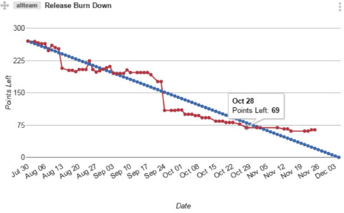

Agile manifesto (reminder)
======
 

 
Here is a quick reminder of the Agile Manifesto’s content from 2001, followed by some examples with code, doc, charts, and tasks (classic VS agile way).
 

 
## Content
 
* Manifesto
* Examples
 
## Manifesto
 
[Twelve Principles of Agile Software](http://agilemanifesto.org/principles.html)
You can read more at “Twelve Principles of Agile Software“.
 
## Comment
 
Some people think that Agile means “no documentation”, “no obligation to the client”, “no planning”.
 
It’s false.
 
As the authors said, “we value the items on the left more“, more doesn’t mean only/not-the-others.
 
## Examples
 

 
You can see Agile like this:
 
## 1. Individuals and interactions over processes and tools
 
Example with task management:
 
Instead of using a dedicated software like JIRA at start, with accounts, hosting, user training, etc.
 

 

 
You can just use post-it on a wall, let people move it themselves. Then change this process/tool later on if needed, as the project grow.
 

 

 
## 2. Working software over comprehensive documentation
 
Example with Java code:
 
Instead of doing this classic POJO.
 
```java
/**
 * The object containing the value.
 */
public class ClassicClass {
 
    /**
     * The value
     */
    private String value;
 
    /**
     * Getter for value.
     * @return the value
     */
    public String getValue() {
        return value;
    }
 
    /**
     * Setter for value.
     * @param value the value to set
     */
    public void setValue(String value) {
        this.value = value;
    }
 
}
```
 
You can use the same amount of time doing this:
 
```java
/**
 * Value Object.
 * The value is mandatory, and read-only.
 */
public class AgileClass {
 
    private String value;
 
    public String getValue() {
        return value;
    }
 
    public AgileClass(String requiredValue) {
        if(requiredValue== null | requiredValue.isEmpty())
            thorw new IllegalArgumentException("value must not be empty!");
        this.value = requiredValue;
    }
}
```
 
It has stronger code (null check, not setter), auto-documented (requiredValue name), with only relevant documentation (class header)
 
## 3. Customer collaboration over contract negotiation
 
Example with features:
 
Instead of doing all features requested by your client without hesitation.
 

 

 
You can : Ask him which are the keyfeatures and start only with it, then show him how much each of them cost, and let him decide if some of them are really mandatory for him (it’s not always the most expensive feature that adds the most value)
 

 

 
## 4. Responding to change over following a plan
 
Example with project delay change:
 
Instead of just reevaluating tasks randomly.
 

 

 
You can evaluate the project feasibility over time (using the burndown chart). Then remove/transform/add features or stop the project before it’s too late.
 

 

 
## Reference
 
[http://agilemanifesto.org/](http://agilemanifesto.org/)
http://agilemanifesto.org/
 
[https://en.wikipedia.org/wiki/Agile_software_development#The_Agile_Manifesto](https://en.wikipedia.org/wiki/Agile_software_development#The_Agile_Manifesto)
https://en.wikipedia.org/wiki/Agile_software_development#The_Agile_Manifesto
 
[https://en.wikipedia.org/wiki/Burn_down_chart](https://en.wikipedia.org/wiki/Burn_down_chart)
https://en.wikipedia.org/wiki/Burn_down_chart
 
## Source
 
[https://github.com/DamienFremont/blog/tree/master/20171110-agile-manifesto-reminder](https://github.com/DamienFremont/blog/tree/master/20171110-agile-manifesto-reminder)
https://github.com/DamienFremont/blog/tree/master/20171110-agile-manifesto-reminder
 
 
## Origin
[https://damienfremont.com/2017/11/10/agile-manifesto-reminder/](https://damienfremont.com/2017/11/10/agile-manifesto-reminder/)
 
