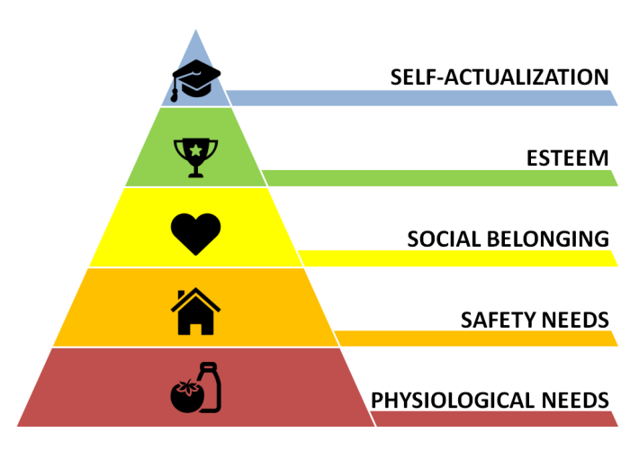
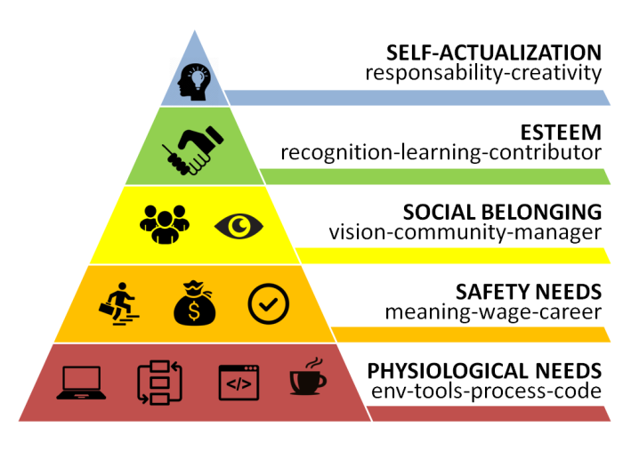

Maslow’s hierarchy of needs for Software Developers
======
 

 
A remake of the Maslow’s pyramid, but for software developers.
 

 
##  Content
 
* Original pyramid
* Developer pyramid
 
## Original Pyramid
 

 

 
## Developer Pyramid
 

 

 
## 1. Physiological Needs
 
* Env: a comfortable environment, with good chair and coffee!
* Tools: a quiet computer with a good screen, mouse and keyboard.
* Process: light processes, iterative instead of waterfall
* Code: avoid technical debt, and no deprecated frameworks
 
## 2. Safety Needs
 
* Meaning: your work makes sense, product will be used
* Wage: the remuneration reflects the work
* Career: it is possible to progress
 
## 3. Social Belonging
 
* Vision: project vision is clear
* Community: belong to a community, not solo developer
* Manager: manager who actually gets down to work
 
## 4. Esteem
 
* Recognition: be recognized as an asset
* Learning: work add experience to developer’s profile
* Contributor: developer adds value to community
 
## 5. Self-actualization
 
* Responsibility: to receive responsibility, be in charge
* Creativity: have the freedom to create your solutions
 
 
 
## References
 
[https://en.wikipedia.org/wiki/Maslow%27s_hierarchy_of_needs](https://en.wikipedia.org/wiki/Maslow%27s_hierarchy_of_needs)
https://en.wikipedia.org/wiki/Maslow%27s_hierarchy_of_needs
 
[http://www.softfluent.fr/blog/societe/2015/07/22/Comment-motiver-les-developpeurs](http://www.softfluent.fr/blog/societe/2015/07/22/Comment-motiver-les-developpeurs)
http://www.softfluent.fr/blog/societe/2015/07/22/Comment-motiver-les-developpeurs
 

 
## Source
 
[https://github.com/DamienFremont/blog/tree/master/20171111-dev-maslow-pyramid](https://github.com/DamienFremont/blog/tree/master/20171111-dev-maslow-pyramid)
https://github.com/DamienFremont/blog/tree/master/20171111-dev-maslow-pyramid
 
 
## Origin
[https://damienfremont.com/2017/11/11/maslows-hierarchy-of-needs-for-software-developers/](https://damienfremont.com/2017/11/11/maslows-hierarchy-of-needs-for-software-developers/)
 
