REST API Maturity Levels : From 0 to 5
======
 

 
This article is about RESTful maturity. It’s not a definition of levels of REST itself, but a simple approach with examples with HTTP, Spring.
 

 
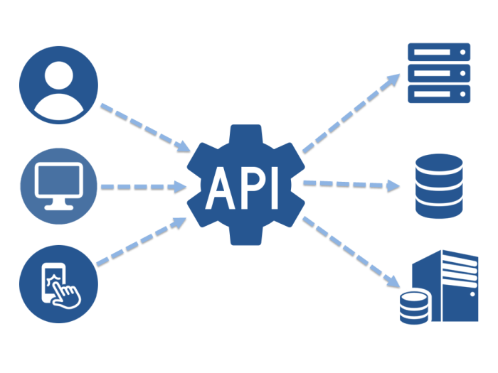
 

 
## Content
 
* What’s an API ?
* What’s REST?
* Steps toward REST
* REST API Level 0
* REST API Level 1
* REST API Level 2
* REST API Level 3
* REST API Level 4
* REST API Level 5
 
## What’s an API ?
 
“defined methods of communication between various software components”
 
[Wikipedia](https://en.wikipedia.org/wiki/Application_programming_interface)
Wikipedia
 
## What’s REST?
 
[WebAPI](https://en.wikipedia.org/wiki/Application_programming_interface#Web_APIs)
REST or RESTful is not a standard, but a WebAPI
 
* Client-Server Architecture
* Stateless
* Cacheability
* Layered System
* Uniform Interface
 
“By using a stateless protocol and standard operations, REST systems aim for fast performance, reliability, and the ability to grow, by re-using components that can be managed and updated without affecting the system as a whole, even while it is running.”
 
[Wikipedia](https://en.wikipedia.org/wiki/Representational_state_transfer)
Wikipedia
 
## Steps toward REST
 
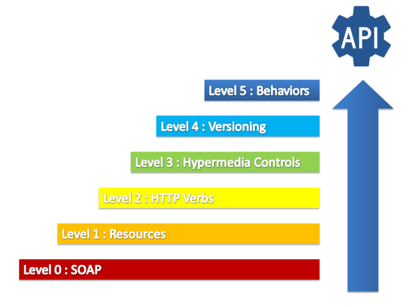
 
[https://martinfowler.com/articles/richardsonMaturityModel.html](https://martinfowler.com/articles/richardsonMaturityModel.html)
First levels are now industry standards conventions, the lasts levels are more business oriented.

See more at https://martinfowler.com/articles/richardsonMaturityModel.html
 
## REST API Level 0
 
Using HTTP 1.1 protocol !
 
* Client-Server : request-response protocol
* Uniform : web standard
* Layered System : HTTP hide underlying technology (database, cache, file, etc)
 
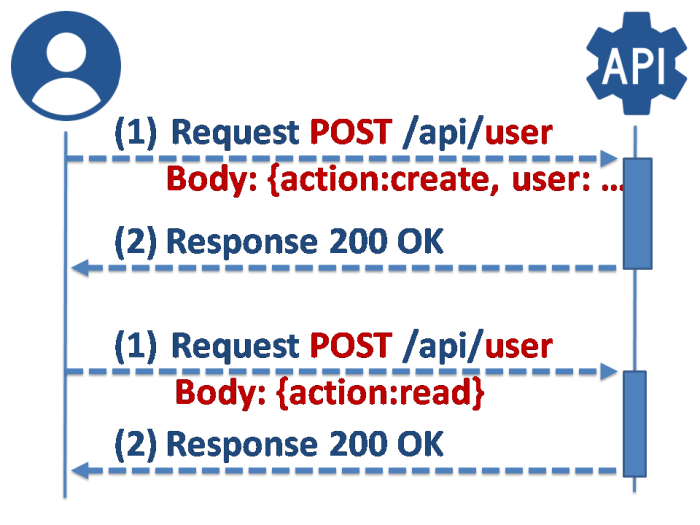
 

 
```
CREATE : POST /api/user
READ :   POST /api/user
UPDATE : POST /api/user
DELETE : POST /api/user

```
## Example : SOAP over HTTP
 
Request
 
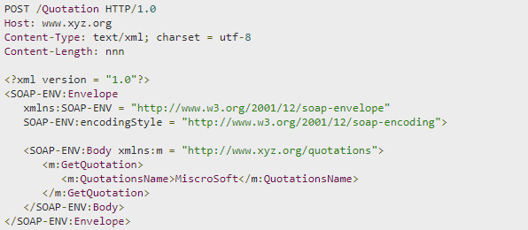
 

 
Response
 
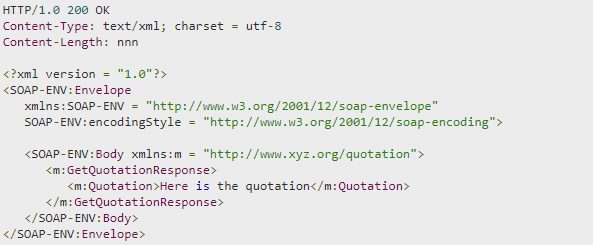
 

 
[https://www.tutorialspoint.com/soap/soap_examples.htm](https://www.tutorialspoint.com/soap/soap_examples.htm)
https://www.tutorialspoint.com/soap/soap_examples.htm
 
## 
 
## REST API Level 1
 
1 Resource = 1 URI (like /api/users/…).
 
* Stateless : only 1 URI, so no state in path (no /user/creation, just /users)
* Uniform: URI is universal, URI don’t change
 
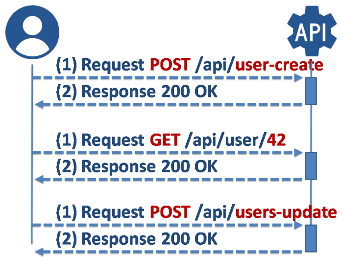
 

 
```
CREATE : POST /api/users/create
READ   : GET /api/users, GET /api/user/read
UPDATE : POST /api/users/update
DELETE : POST /api/users/delete

SEARCH : GET or POST /api/users?sort=name

```
Details
 
* static path : no /user and  /users and /user-new …just /users
* redirection : no /users and /users/ …just /users
* case insensitive :  no /User/RoleGroup …just /user/role-group
* format/parameters: no /users/xml/sort-by-name …just /user?format=xml&sort=name
 
## Example : Same HTTP action for two different actions!
 
Update Request
 
```
POST /api/users HTTP/1.1
Host api.host.com
 
...
```
 
Delete Request
 
```
POST /api/users-delete HTTP/1.1
Host api.host.com
 
...
```
 
## 
 
## REST API Level 2
 
Actions inside URI (like /api/users {GET, PUT, POST, DEL}) !
 
* Uniform: using HTTP method for CRUD methods
* Cacheability : cache on READ, Idempotence on Actions
 
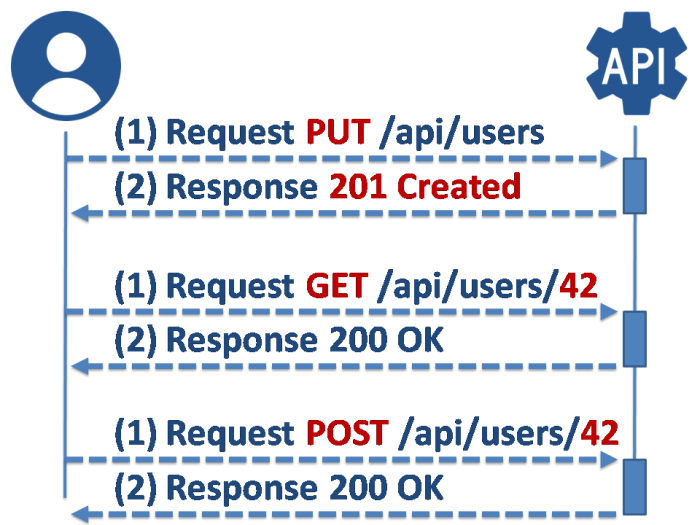
 

 
```
CREATE : PUT /api/users
READ   : GET /api/users/42
UPDATE : POST /api/users/42
DELETE : DEL /api/users/42
SEARCH : GET /api/users?sort=name

```
Details
 
* no action in URL : no /users/delete or /users-delete …just DEL /users
* list/array : no unique response object …just a list of IDs, then client will get datas (if not in cache) by calling resource/IDs
* Cache: resources ID in response instead of data
* Idempotence : actions can be applied multiple times without changing the result (ex: delete user/42 multiple time will only delete 1 row in database)
 
## Example : GitHub Single Object (Uniforme)
 
Request
 
```
GET /users/DamienFremont HTTP/1.1
Host api.github.com
```
 
Response (then cached for next usages)
 
```
HTTP/1.1 200 OK
 
{
  "login": "DamienFremont",
  "id": 123456,
  "url": "https://api.github.com/users/DamienFremont",
  // ...
}
```
 
## Example : GitHub Collection (Cacheability)
 
Request
 
```
GET /users/DamienFremont/followers HTTP/1.1
Host api.github.com
```
 
Response
 
```
HTTP/1.1 200 OK
 
[
 "https://api.github.com/users/jeanmichel72",
 "https://api.github.com/users/alien42",
  // ...
]
```
 
instead of this (not cacheable because some parts could change over time. ex: user update)
 
```
HTTP/1.1 200 OK
 
[
 { "login": "jeanmichel72", "id": 123456, ...},
 { "login": "alien42", "id": 123456, ...},
 // ...
```
 
## 
 
## REST API Level 3
 
RESTful or HATEOAS (Hypermedia As Engine of Application State) !
 
* Uniform : Self-descriptive
 
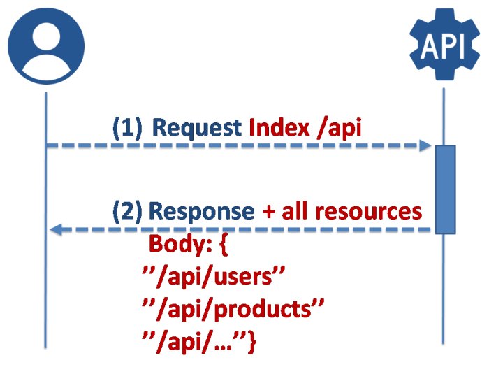
 

 
```
CREATE : PUT /api/users/create
READ : GET /api/users/42
UPDATE : POST /api/users/42
DELETE : DEL /api/users/42
SEARCH : GET /api/users?sort=name

Self-descriptive Response Body:
HTTP/1.1 200 OK

{
  "_embedded" : {
    "users" : [ {
      "username" : "admin", ...
      "_links" : {
        "self" : { "href" : "http://localhost:8080/api/users/1" },
        "user" : { "href" : "http://localhost:8080/api/users/1" }
      }
    }, {
      ...
    } ]
  },
  "_links" : { "self" : { "href" : "http://localhost:8080/api/users{?page,size,sort}", },
  "search" : { "href" : "http://localhost:8080/api/users/search" } },
  "page" : {
    "size" : 20,
    "totalElements" : 27,
    "totalPages" : 2,
    "number" : 0
  }
}

```
Details
 
* Self-descriptive : API index summarizes all the resources
* No question nor  interpretation required about navigability, URI, URL, format
* No need for documentation
 
## Example : Spring Self-descriptive Generated API
 
Spring API Request
 
```
<span                data-mce-type="bookmark"                id="mce_SELREST_start"              data-mce-style="overflow:hidden;line-height:0"              style="overflow:hidden;line-height:0"           ></span>
GET /api/ HTTP/1.1
Host localhost:8080
```
 
Spring API Response
 
```
HTTP/1.1 200 OK
 
{
  "_links" : {
    "users" : {
      "href" : "http://localhost:8080/api/users{?page,size,sort}",
      "templated" : true
    }
  }
}
```
 
## 
 
## REST API Level 4
 
API Versionning !
 
* Uniform : Self-descriptive
 
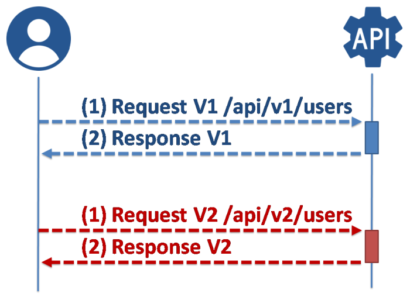
 

 
```
CREATE : PUT /api/users/create
READ : GET /api/users/42
UPDATE : POST /api/users/42
DELETE : DEL /api/users/42
SEARCH : GET /api/users?sort=name
...Self-descriptive Response body :
{
  "_links" : {
    "users" : {
      "href" : "http://localhost:8080/api/users{?page,size,sort}"
    }
  }
}

...Version Request URI:
GET /api/v2/user.json HTTP/1.1
Host api.host.com

```
Details:  2 solutions
 
* Path-based approch, in which the client defines the version in URL: http://localhost:9001/api/v1/user
http://localhost:9001/api/v2/user
* Content-Type header, in which the client defines the version in Accept header: http://localhost:9001/api/v1/user with 
Accept: application/vnd.app-1.0+json OR application/vnd.app-2.0+json
 
Note: Since i am working a lot with rest documentation tools, i prefer to use the first approach.
 
## Example : Implementation with Spring
 
```java
import io.swagger.annotations.*;
import org.springframework.stereotype.*;
import org.springframework.web.bind.annotation.*;
 
@Controller
@Api(value = "user", description = "Operations about users")
public class UserController {
 
    @ResponseBody
    @RequestMapping(method = RequestMethod.GET, value = "/api/v1/user")
    @ApiOperation(value = "Returns user", notes = "Returns the user", tags = <span               data-mce-type="bookmark"                id="mce_SELREST_start"              data-mce-style="overflow:hidden;line-height:0"              style="overflow:hidden;line-height:0"           ></span>{"GET", "User"})
    public String getUserV1() {
         return "User V1";
    }
 
    @ResponseBody
    @RequestMapping(method = RequestMethod.GET, value = "/api/v2/user")
    @ApiOperation(value = "Returns user", notes = "Returns the user", tags = {"GET", "User"})
    public String getUserV2() {
         return "User V2";
    }
 }
```
 
Or you can duplicate/redirect to the old V1 classes.
 
## 
 
## REST API Level 5
 
Add behaviors to API responses !
 
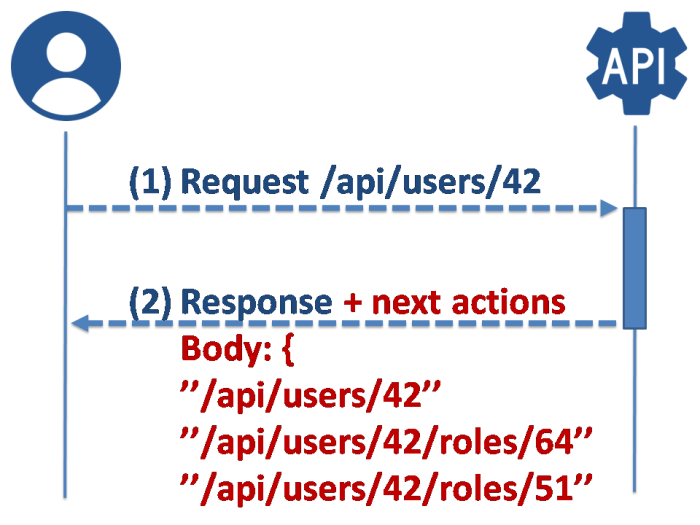
 

 
```
CREATE : PUT /api/users/create 
READ : GET /api/users/42 
UPDATE : POST /api/users/42 
DELETE : DEL /api/users/42 
SEARCH : GET /api/users?sort=name 
...Self-descriptive Response body : 
{ 
  "_links" : { 
    "users" : { 
      "href" : "http://localhost:8080/api/users{?page,size,sort}" } } } 
...Version Request URI: 
GET /api/v2/user.json HTTP/1.1 
Host api.host.com

...Behavior in Response body 
HTTP/1.1 201 OK 
{ 
  "_links" : { 
    "self" : { "href" : "http://localhost:8080/api/users/1" }
}
```
Details
 
* user/app can discover API by using it
* next actions are directly provided to client, so no need to store all static URL in client source code, and after a CREATE you can directly use the resource with the newly provided READ URL
 
## Example : User CREATE return READ/UPDATE/DELETE behaviours
 
Spring API Request
 
```
PUT /api/user HTTP/1.1
Host localhost:8080
 
{
  "firstname" : "Damien",
  "lastname" : "FREMONT"
}
```
 
Spring API Response, with URL and newly created ID
 
```
HTTP/1.1 201 OK
 
{
  "_links" : {
    "self" : { "href" : "http://localhost:8080/api/users/1" },
    "user" : { "href" : "http://localhost:8080/api/users/1" },
  }
}
```
 
## 
 
## Conclusion
 
REST API self-descriptive can be enhanced with tools; like Swagger for autodocumentation and Spring for implementation.
 
Swagger
 
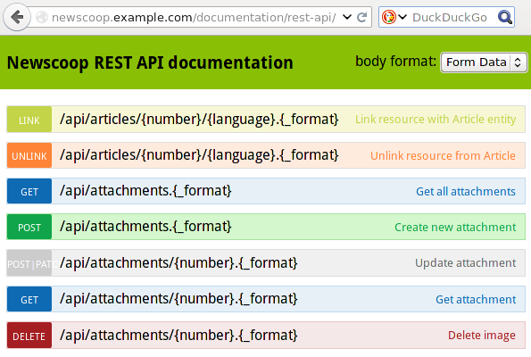
 

 
Spring REST Data generated API is a good example of RESTful, with uniform URI, discoverability via JSON response meta-data.
 
Spring Implementation
 
```java
import org.springframework.data.jpa.repository.JpaRepository;
import org.springframework.stereotype.Repository;
 
@Repository
public interface UserRepository extends JpaRepository&amp;lt;User, Long&amp;gt; {
   User findByUsername(String username);
}
```
 
Spring API Request
 
```
GET /api/ HTTP/1.1
Host localhost:8080
```
 
Spring API Response
 
```
HTTP/1.1 200 OK
 
{
  "_links" : {
    "profiles" : {
      "href" : "http://localhost:8080/api/profiles{?page,size,sort}",
      "templated" : true
    },
    "users" : {
      "href" : "http://localhost:8080/api/users{?page,size,sort}",
      "templated" : true
    }
  }
}
```
 
Spring API Request
 
```
GET /api/users HTTP/1.1
Host localhost:8080
```
 
Spring API Response
 
```
HTTP/1.1 200 OK
{
  "_embedded" : {
    "users" : [ {
      "dateCreated" : null,
      "lastUpdated" : null,
      "username" : "admin",
      "enabled" : true,
      "accountNonExpired" : true,
      "credentialsNonExpired" : true,
      "accountNonLocked" : true,
      "roles" : [ ...],
      "_links" : {
        "self" : {
          "href" : "http://localhost:8080/api/users/1"
        },
        "user" : {
          "href" : "http://localhost:8080/api/users/1"
        }
      }
    }, {
      ...
    } ]
  },
  "_links" : {
    "self" : {
      "href" : "http://localhost:8080/api/users{?page,size,sort}",
      "templated" : true
    },
    "profile" : {
      "href" : "http://localhost:8080/api/profile/users"
    },
    "search" : {
      "href" : "http://localhost:8080/api/users/search"
    }
  },
  "page" : {
    "size" : 20,
    "totalElements" : 27,
    "totalPages" : 2,
    "number" : 0
  }
}
```
 
## References
 
[https://en.wikipedia.org/wiki/Application_programming_interface](https://en.wikipedia.org/wiki/Application_programming_interface)
https://en.wikipedia.org/wiki/Application_programming_interface
 
[https://fr.wikipedia.org/wiki/Representational_state_transfer](https://fr.wikipedia.org/wiki/Representational_state_transfer)
https://fr.wikipedia.org/wiki/Representational_state_transfer
 
[http://www.baeldung.com/rest-versioning](http://www.baeldung.com/rest-versioning)
http://www.baeldung.com/rest-versioning
 
[https://stackoverflow.com/questions/20198275/how-to-manage-rest-api-versioning-with-spring](https://stackoverflow.com/questions/20198275/how-to-manage-rest-api-versioning-with-spring)
https://stackoverflow.com/questions/20198275/how-to-manage-rest-api-versioning-with-spring
 
[https://martinfowler.com/articles/richardsonMaturityModel.html](https://martinfowler.com/articles/richardsonMaturityModel.html)
https://martinfowler.com/articles/richardsonMaturityModel.html
 
[https://www.infoq.com/fr/presentations/bow-virginie-bardales-rest-world?utm_source=presentations_about_best-of-web&utm_medium=link&utm_campaign=best-of-web](https://www.infoq.com/fr/presentations/bow-virginie-bardales-rest-world?utm_source=presentations_about_best-of-web&utm_medium=link&utm_campaign=best-of-web)
https://www.infoq.com/fr/presentations/bow-virginie-bardales-rest-world?utm_source=presentations_about_best-of-web&utm_medium=link&utm_campaign=best-of-web
 
## On GitHub
 
[https://github.com/DamienFremont/blog/tree/master/20171123-rest-api-maturity-levels-from-0-to-5](https://github.com/DamienFremont/blog/tree/master/20171123-rest-api-maturity-levels-from-0-to-5)
https://github.com/DamienFremont/blog/tree/master/20171123-rest-api-maturity-levels-from-0-to-5
 
 
## Origin
[https://damienfremont.com/2017/11/23/rest-api-maturity-levels-from-0-to-5/](https://damienfremont.com/2017/11/23/rest-api-maturity-levels-from-0-to-5/)
 
