HowTo Eclipse: Fix AutoImport for List Map
======
 

 
When you let your Eclipse IDE auto-organize your List/Map imports, it struggles with it and break …it’s a loss of productivity on every single file ! (ex: duplicate classes like List: java.awt.List, java.util.List and Map)
 

 
## The Problem
 
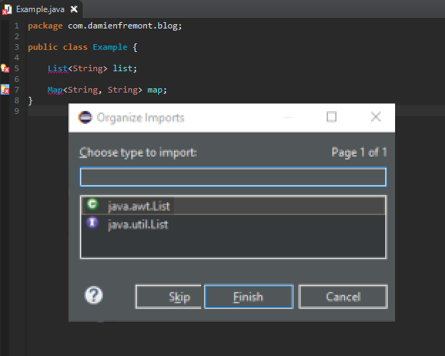
 

 
‘Source -> Organize imports ‘ is not working for List or Map, an ask for user resolution (you), for each file ! But in Java, we only need java.util.List and java.util.Map. And these classes are massively used in Java projects.
 
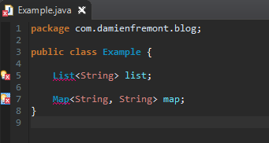
 

 
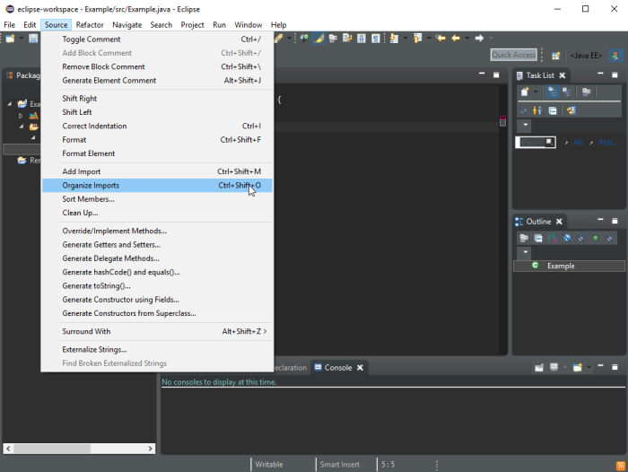
 

 
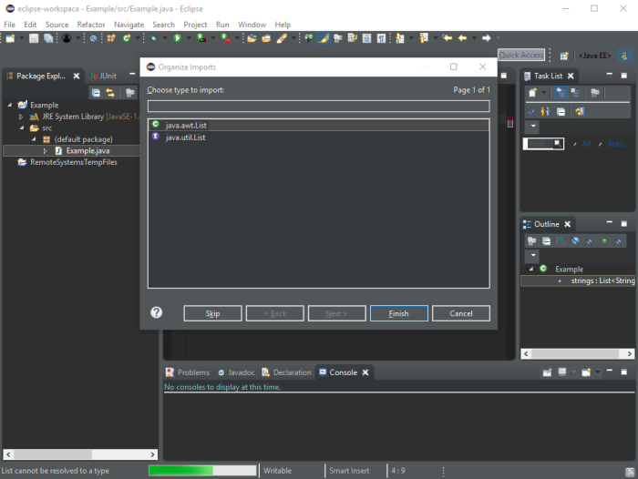
 

 

 

 
## Steps
 
* import Eclipse preference
* or
* set Eclipse preference
 
## Import Eclipse preference
 
File -> Import -> Preferences -> Browse -> (choose file ‘eclipse-pref-autoimport.epf’) -> Finish (…then check it : Window -> Preferences -> Java -> Appearance -> Type Filters )
 
## Eclipse Preference File Content
 
Download here :
 
[https://raw.githubusercontent.com/DamienFremont/blog/master/20171124-eclipse-ide-fix-autoimport-config/eclipse-pref-autoimport.epf](https://raw.githubusercontent.com/DamienFremont/blog/master/20171124-eclipse-ide-fix-autoimport-config/eclipse-pref-autoimport.epf)
https://raw.githubusercontent.com/DamienFremont/blog/master/20171124-eclipse-ide-fix-autoimport-config/eclipse-pref-autoimport.epf
 
eclipse-pref-autoimport.epf
 
```
#Fri Nov 24 13:10:54 CET 2017
/instance/org.eclipse.jdt.ui/org.eclipse.jdt.ui.typefilter.enabled=antlr.collections.*;COM.*;com.ibm.*;com.sun.*;java.awt.*;org.hibernate.mapping.List;org.omg.*;sun.*;
@org.eclipse.jdt.ui=3.13.50.v20170929-1653
file_export_version=3.0

```
## Steps
 
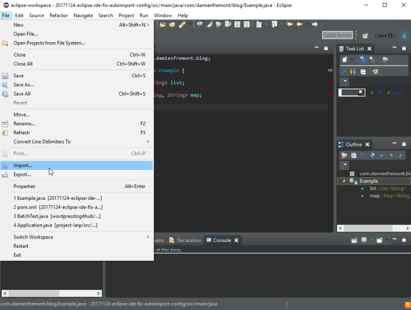
 

 
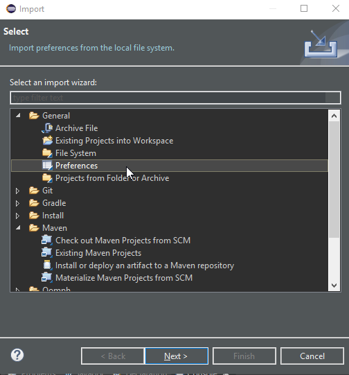
 

 
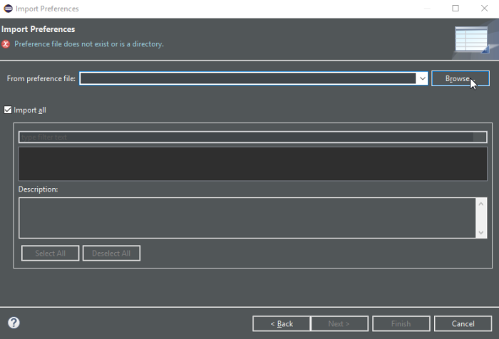
 

 
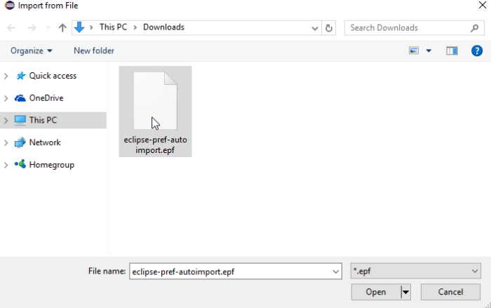
 

 
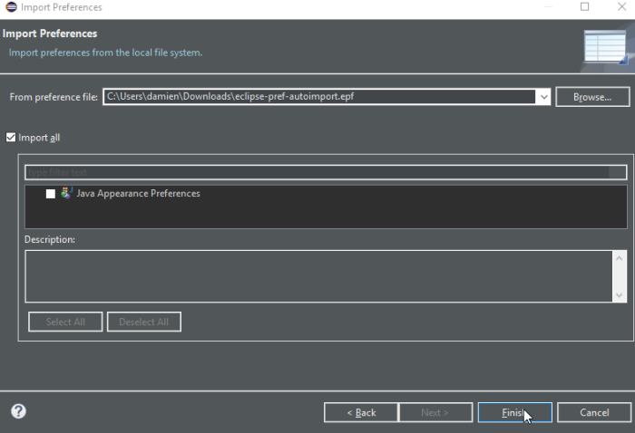
 

 
check it
 

 

 
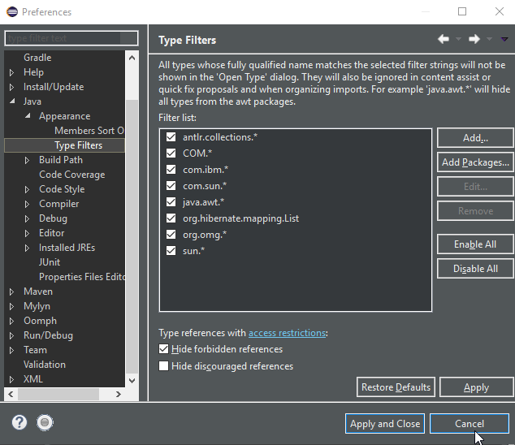
 

 
## Set Eclipse preference
 
Window -> Preferences -> Java -> Appearance -> Type Filters -> Add (N times, like ‘java.awt.*’, ‘antlr’)
 
## Eclipse Preference Filters
 
```
antlr.collection.*
COM.*
com.ibm.*
com.sun.*
java.awt.*
org.hibernate.mapping.List
org.omg.*
sun.*
```
## Steps
 

 

 
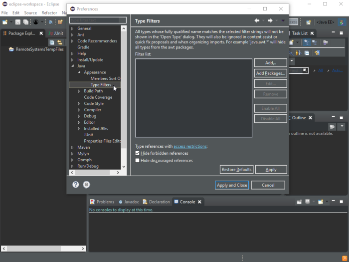
 

 
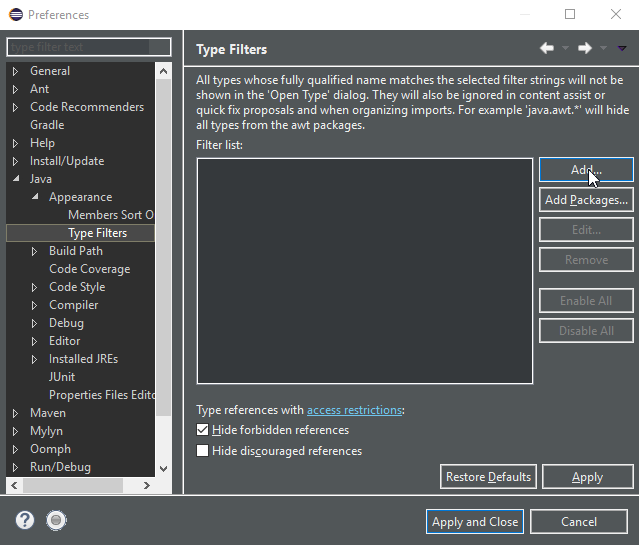
 

 
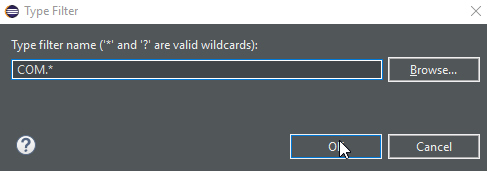
 

 
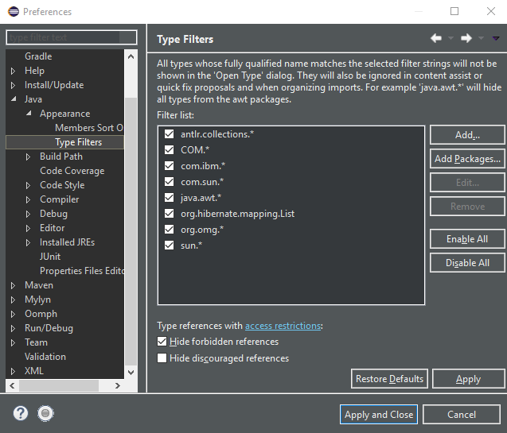
 

 
 
 
## References
 
[http://stackoverflow.com/questions/2073913/eclipse-exclude-specific-packages-when-autocompleting-a-class-name](http://stackoverflow.com/questions/2073913/eclipse-exclude-specific-packages-when-autocompleting-a-class-name)
http://stackoverflow.com/questions/2073913/eclipse-exclude-specific-packages-when-autocompleting-a-class-name
 
## On GitHub
 
[https://github.com/DamienFremont/blog/tree/master/20171124-eclipse-ide-fix-autoimport-config](https://github.com/DamienFremont/blog/tree/master/20171124-eclipse-ide-fix-autoimport-config)
https://github.com/DamienFremont/blog/tree/master/20171124-eclipse-ide-fix-autoimport-config
 
 
## Origin
[https://damienfremont.com/2017/11/24/howto-eclipse-fix-autoimport-for-list-map/](https://damienfremont.com/2017/11/24/howto-eclipse-fix-autoimport-for-list-map/)
 
