HowTo JS – Node Debug in Visual Studio Code
======
 

 
Visual Studio Code has support for JavaScript and out-of-the-box Node.js debugging. Here’s how.
 

 
## Steps
 
* open project
* install
* start
* stop
* debug mode start
* debug code
* debug mode stop
 
## Open project
 
Start VSC -> File -> Open Folder -> Select Folder
 
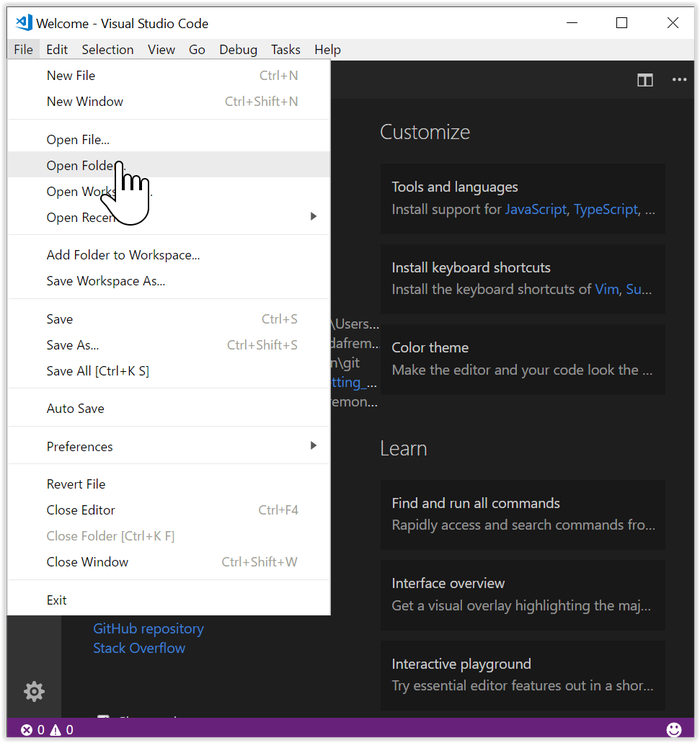
 

 
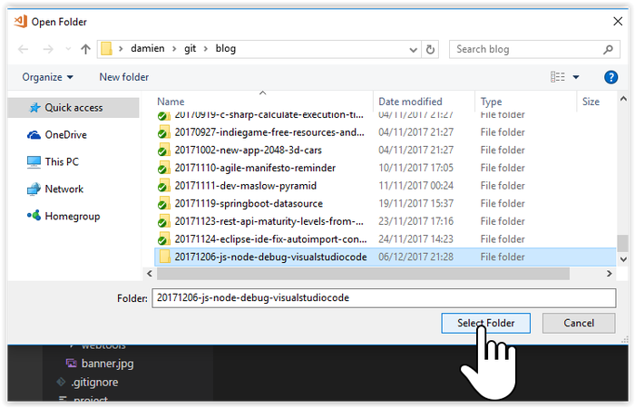
 

 
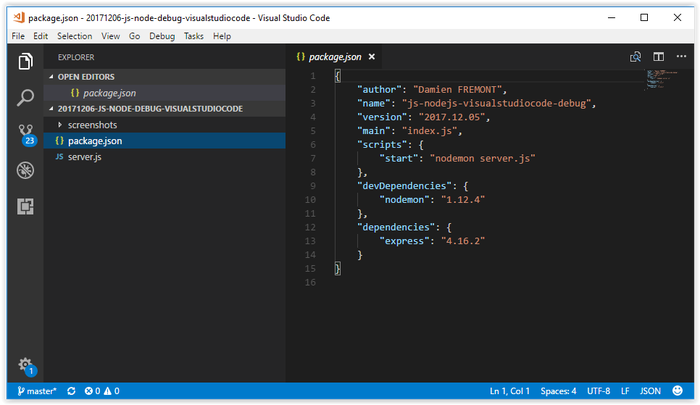
 

 
## Install
 
View -> Integrated Terminal -> “npm install”
 
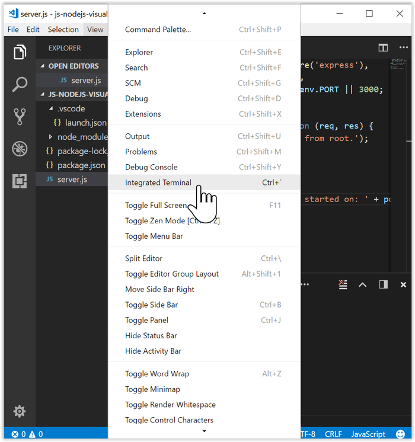
 

 
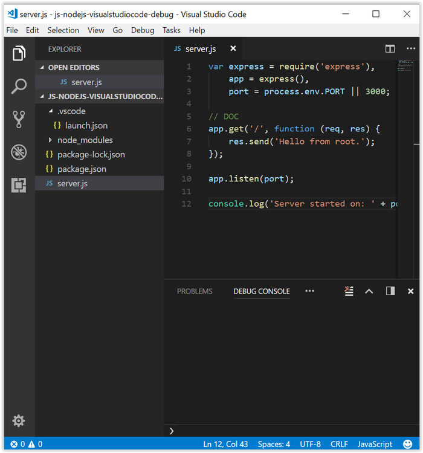
 

 
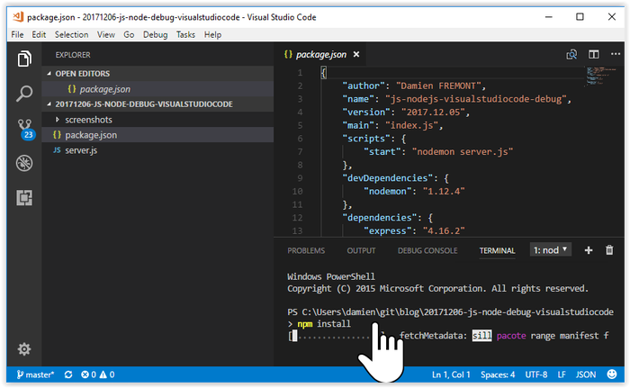
 

 
## Start
 
Integrated Terminal -> “npm start”
 
Start Chrome -> type “localhost:3000”
 
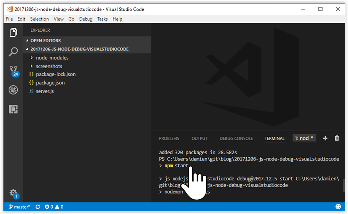
 

 
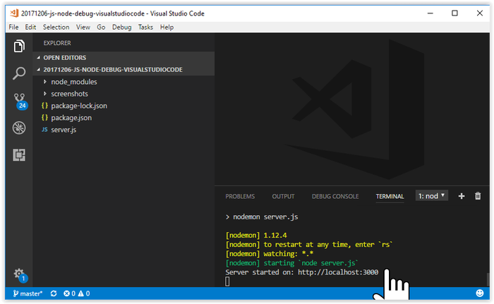
 

 
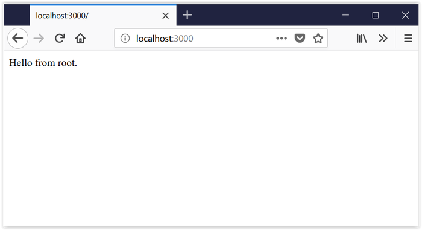
 

 
## Stop
 
Integrated Terminal -> Ctrl+C  -> “Y”+Return
 
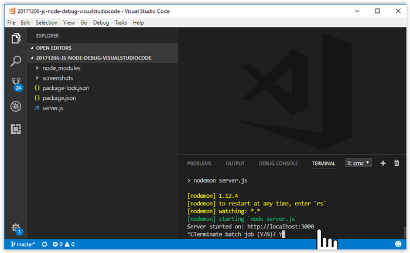
 

 
## Debug Mode Start
 
Debug Icon -> Settings -> NodeJS -> launch.json -> Save -> Debug Start Icon
 
launch.json
 
```javascript
{
    "version": "0.2.0",
    "configurations": [
        {
            "type": "node",
            "request": "launch",
            "name": "Launch Program",
            "program": "${workspaceFolder}/server.js"
        }
    ]
}
```
 
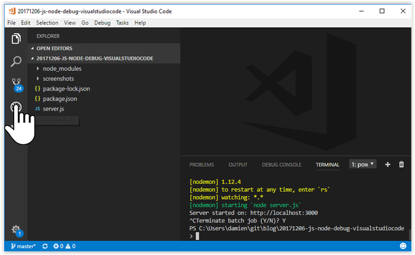
 

 
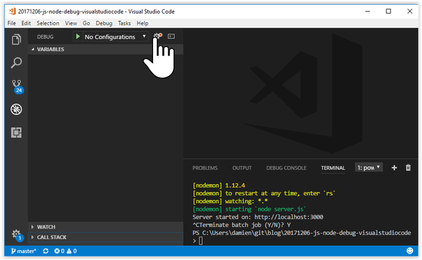
 

 
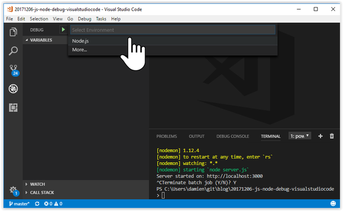
 

 
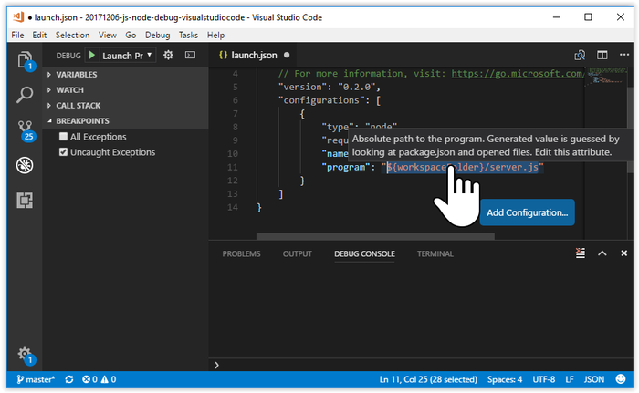
 

 
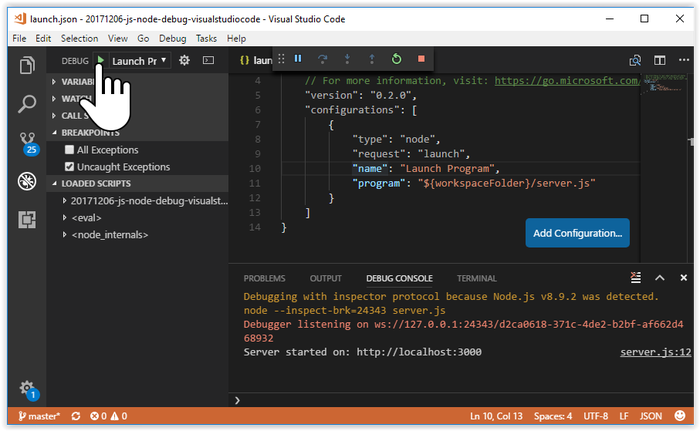
 

 
 
 
## Debug Code
 
Explorer Icon -> server.js -> add breakpoitn by double-clicking on line 7
 
Open Browser -> refresh (F5)
 
Open VSC -> Hover on source vars & params -> press Debug Continue Icon (F5)
 
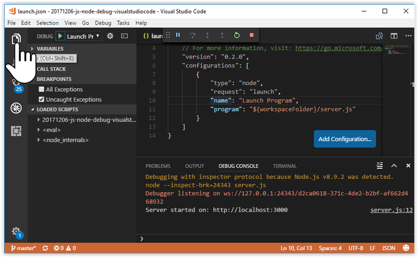
 

 
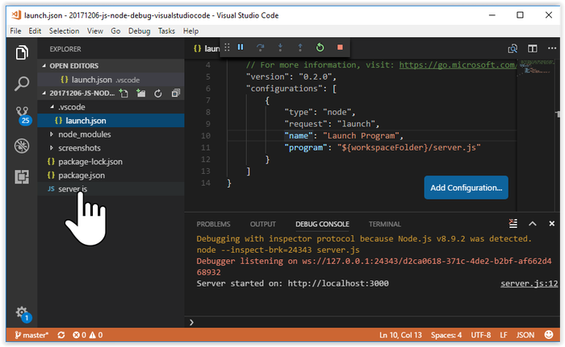
 

 
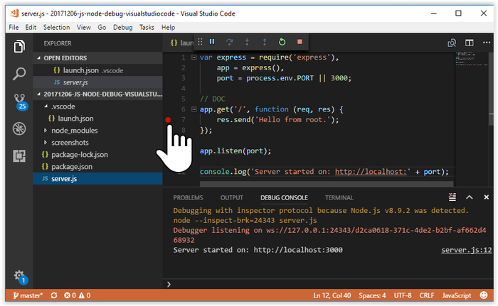
 

 
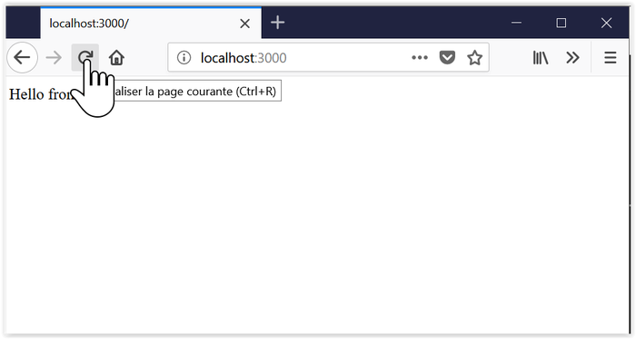
 

 
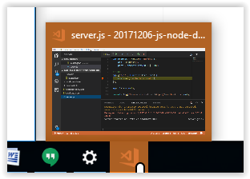
 

 
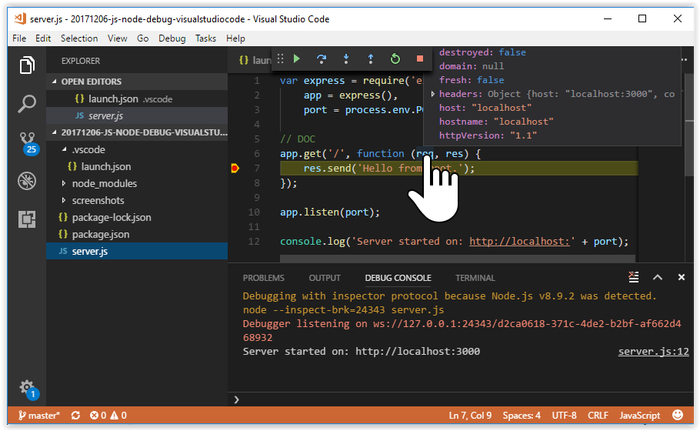
 

 
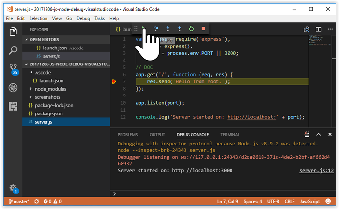
 

 
## Debug Mode Stop
 
Debug Stop Icon
 
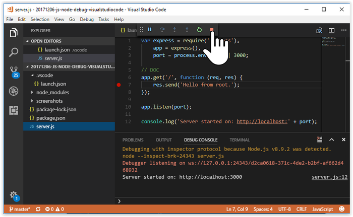
 

 
## Source on GitHub
 
[https://github.com/DamienFremont/blog/tree/master/20171206-js-node-debug-visualstudiocode](https://github.com/DamienFremont/blog/tree/master/20171206-js-node-debug-visualstudiocode)
https://github.com/DamienFremont/blog/tree/master/20171206-js-node-debug-visualstudiocode
 
## References
 
[https://code.visualstudio.com/docs/nodejs/nodejs-tutorial](https://code.visualstudio.com/docs/nodejs/nodejs-tutorial)
https://code.visualstudio.com/docs/nodejs/nodejs-tutorial
 
 
 
 
## Origin
[https://damienfremont.com/2017/12/06/howto-js-node-debug-visual-studio-code/](https://damienfremont.com/2017/12/06/howto-js-node-debug-visual-studio-code/)
 
