HowTo JS – Node Express REST API
======
 

 
Express has support for REST API. This example is inspired by SpringBoot’s Data/REST generated API, with auto-doc. Here’s how.
 

 
## Steps
 
* Source
* Install
* Start
* Test
 
## Source
 
* userListRoutes.js: contains route associated with impl (controllers), and simple doc at the API root route.
* userListModel.js: actual service/resource implementation, call data layer (service/repository/dao)
* userListModel.js:  repository + datas (mock here)
 
userListRoutes.js
 
```javascript
'use strict';
var express = require('express'),
  userList = require('./userListController');
 
var api = express.Router();
 
// DOC
var infos = function (req, res) {
  var json = {
    _links: {
      users: {
        href: "http://localhost:3000/api/users"
      }
    }
  };
  res.send(json);
};
api.get('/', infos);
 
// API
api.get('/users', userList.list_all_users);
api.post('/users', userList.create_a_user);
api.get('/users/:userId', userList.read_a_user);
api.put('/users/:userId', userList.update_a_user);
api.delete('/users/:userId', userList.delete_a_user);
 
module.exports = api;
```
 
 
 
userListController.js
 
```javascript
'use strict';
var Users = require('./userListModel');
 
// READ ALL
exports.list_all_users = function (req, res) {
  Users.find({}, function (err, user) {
    if (err)
      res.status(500).send(err);
    res.json(user);
  });
};
 
// CREATE
exports.create_a_user = function (req, res) {
  Users.save(req.body, function (err, user) {
    if (err)
      res.status(400).send(err);
    res.json(user);
  });
};
 
// READ (ONE)
exports.read_a_user = function (req, res) {
  Users.findById(req.params.userId, function (err, user) {
    if (err)
      res.status(400).send(err);
    res.json(user);
  });
};
 
// UPDATE
exports.update_a_user = function (req, res) {
  Users.save(req.body, function (err, user) {
    if (err)
      res.status(400).send(err);
    res.json(user);
  });
};
 
// DELETE
exports.delete_a_user = function (req, res) {
  Users.remove(req.params.userId, function (err, user) {
    if (err)
      res.status(400).send(err);
    res.json({ message: 'User successfully deleted' });
  });
};
```
 
userListModel.js
 
```javascript
'use strict';
 
// DUMMY DATA / MOCK
var userData = {
  "total": 3,
  "users": [
    {
      "id": "1",
      "username": "user1",
      "role": "ADMIN",
      "status": "ACTIVE"
    },
    {
      "id": "2",
      "username": "user2",
      "role": "USER",
      "status": "ACTIVE"
    },
    {
      "id": "3",
      "username": "user3",
      "role": "USER",
      "status": "DISABLED"
    }
  ]
};
 
// READ ALL
exports.find = function (req, callback) {
  var error = null;
  var response = userData;
  callback(error, response);
};
 
// READ (ONE)
exports.findById = function (userId, callback) {
  var error = null;
  var response = null;
  var actualUser = userData.users.find(x => x.id === userId);
  if (!actualUser)
    error = { "message": "user not found" };
  else
    response = actualUser;
  callback(error, response);
};
 
// DELETE
exports.remove = function (userId, callback) {
  var error = null;
  var actualUser = userData.users.find(x => x.id === userId);
  if (!actualUser) {
    error = { "message": "user not found" };
  } else {
    var response = actualUser;
    var i = userData.users.indexOf(actualUser);
    userData.users.splice(i, 1);
    userData.total = userData.users.length;
  };
  callback(error, response);
};
 
// CREATE OR UPDATE
exports.save = function (user, callback) {
  var error = null;
  var response;
  var userId = user.id;
  if (!userId) {
    var newUser = user;
    var generatedId = Math.floor(Math.random() * 6) + 1;
    newUser.id = generatedId;
    userData.users.push(newUser);
    userData.total = userData.users.length;
    response = newUser;
  } else {
    var actualUser = userData.users.find(x => x.id === userId);
    if (!actualUser)
      error = { "message": "user not found" };
    else {
      actualUser.username = user.username;
      actualUser.role = user.role;
      actualUser.status = user.status;
      response = actualUser;
    }
  }
  callback(error, response);
};
```
 
server.js
 
```javascript
var express = require('express'),
    app = express(),
    port = process.env.PORT || 3000,
    bodyParser = require('body-parser');
 
app.use(bodyParser.urlencoded({ extended: true }));
app.use(bodyParser.json());
 
// API
app.use('/api', require('./api/userListRoutes'));
 
// DOC
app.get('/', function (req, res) {
    res.send('Hello from root route. (please use /api)');
});
 
app.listen(port);
 
console.log('user list RESTful API server started on: ' + port);
```
 
package.json
 
```javascript
{
    "author": "Damien FREMONT",
    "name": "js-node-express-rest-api",
    "version": "2017.12.07",
    "main": "index.js",
    "scripts": {
        "start": "nodemon server.js"
    },
    "devDependencies": {
        "nodemon": "1.12.4"
    },
    "dependencies": {
        "body-parser": "1.18.2",
        "express": "4.16.2"
    }
}
```
 
## Install
 
Start VSC -> View -> Terminal -> “npm install”
 
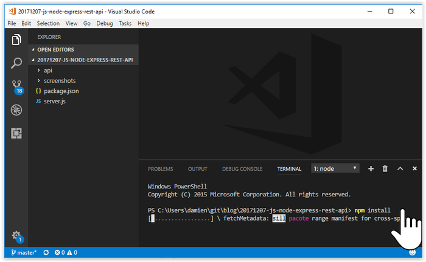
 

 
## Start
 
Terminal -> “npm start”
 
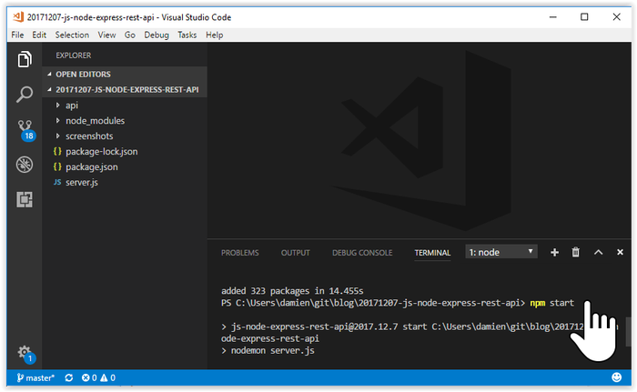
 

 
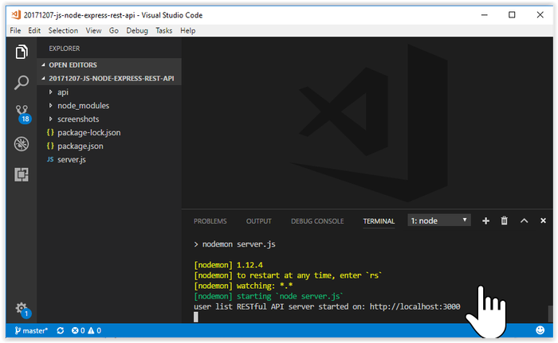
 

 
## Test
 
Start FireFox / Chrome -> type “localhost:3000” -> “localhost:3000/api” -> “localhost:3000/users” -> GET “localhost:3000/users”  -> POST -> etc…
 
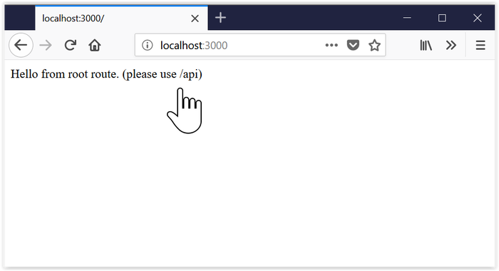
 

 
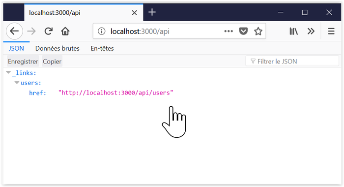
 

 
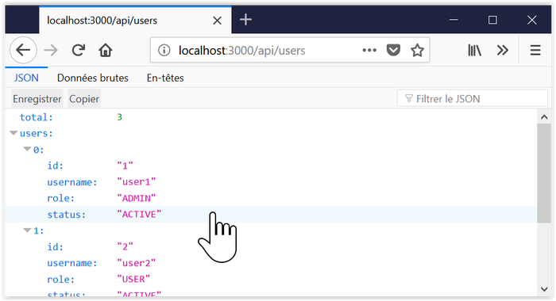
 

 
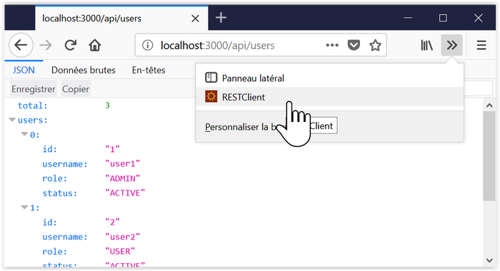
 

 
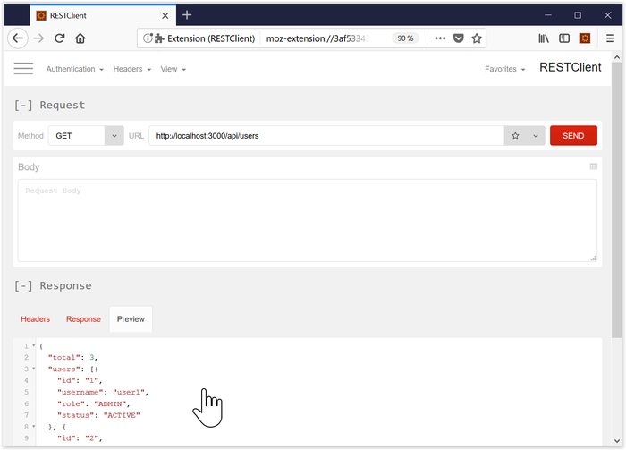
 

 
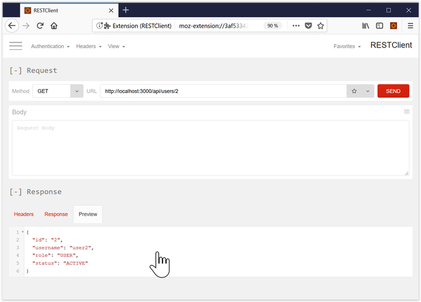
 

 
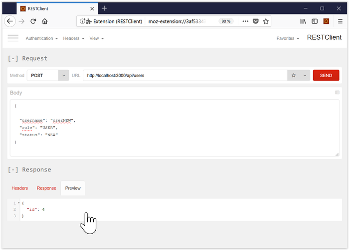
 

 
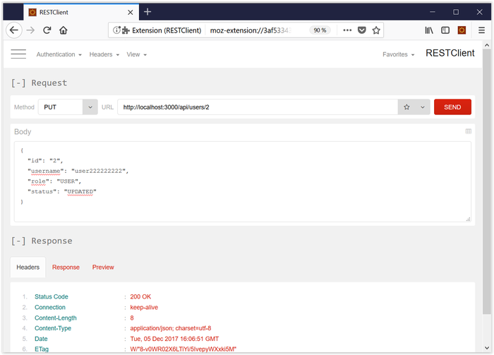
 

 
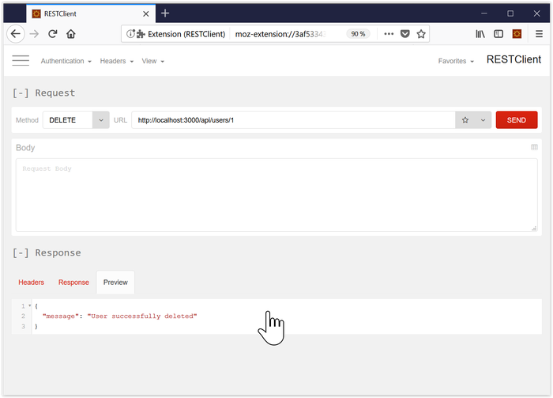
 

 
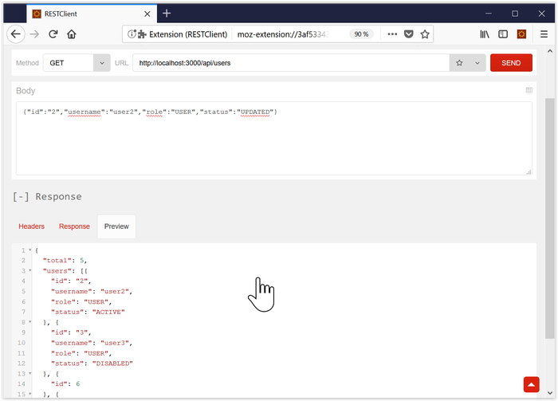
 

 
## References
 
[https://spring.io/guides/gs/accessing-data-rest/](https://spring.io/guides/gs/accessing-data-rest/)
https://spring.io/guides/gs/accessing-data-rest/
 
[https://github.com/expressjs/express/tree/master/examples](https://github.com/expressjs/express/tree/master/examples)
https://github.com/expressjs/express/tree/master/examples
 
## Source on Github
 
[https://github.com/DamienFremont/blog/tree/master/20171207-js-node-express-rest-api](https://github.com/DamienFremont/blog/tree/master/20171207-js-node-express-rest-api)
https://github.com/DamienFremont/blog/tree/master/20171207-js-node-express-rest-api
 
 
## Post on Wordpress
[https://damienfremont.com/2017/12/07/howto-js-node-express-rest-api/](https://damienfremont.com/2017/12/07/howto-js-node-express-rest-api/)
 
