Retour sur DevFest Nantes 2018
---

Nous avons pu participer pour la première fois à la conférence DevFest à Nantes le 18 octobre 2018. Dans cet article à deux mains, nous vous proposons quelques morceaux choisis sur cette expérience et ses talks/conférences.

Pour rappel, DevFest est un événement présent dans plusieurs pays et villes, et très orienté technique.

- [-> Le site](https://devfest.gdgnantes.com/)

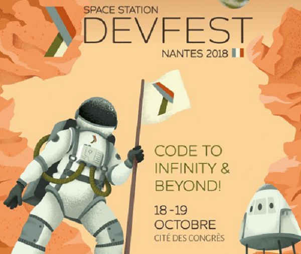

# JEUDI 18 OCTOBRE - 1ER JOUR

Les moments forts: la keynote, les talks, les codelabs et quelques speakers de renom (ex: les GDE 'Google Developer Expert', David Gageot, etc).

---

## 8h30 - Accueil

Du monde! Du monde! Content d'être venu tôt pour être bien placé durant la conférence. 

Bon point pour l'organisation: le badge est aussi un planning des talks ET un plan du site. C'est beaucoup plus pratique que d'autres conférences (le palais des congrès c'est grands! et il n'y a plus besoin d'application mobile, car vous avez l'essentiel autour du cou).

- [-> Aperçu des stands](https://twitter.com/devfestnantes/status/1052838192649367552)
- [-> Sans oublier SQLI !!!](https://mobile.twitter.com/mperrien44/status/1052808577570635776)

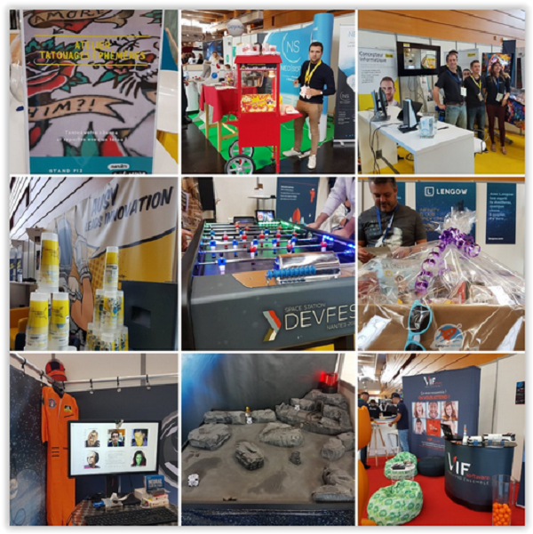

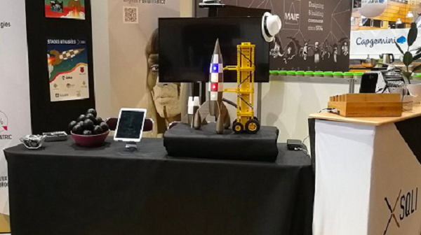

## 9h00 - Keynote d'ouverture

Une grosse vidéo d'intro sur le thème de la conquête spatiale, suivi d'un talk.

Nous avons eu la chance d'avoir un speaker expérimenté pour ce premier talk: Christian HEILMANN (lead developer at Microsoft Germany). Rien de 'disruptif', mais quelques piqures de rappel: les développeurs doivent se comporter en professionnels (ex: attention à la 'hype', se faire à l'idée qu'une application est là pour 10 ans, la dette technique doit être gérée, et nous devons construire en partant de l'existant plutôt que de réinventer constamment la même chose). 

- [-> L'intro de la keynote](https://twitter.com/devfestnantes/status/1052821317303590912)
- [-> Le twitter du speaker](https://twitter.com/codepo8)


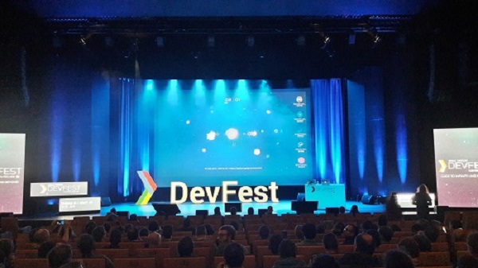 

---

Quelques 'talks' et 'codelab' pour la suite (présentation et travaux pratiques).

## 11h00 - The next big thing in (client side) templating

Un talk sur le futur des templating en web (faire des vues pour nos sites et applications).

Le speaker de chez Google a retracé l'histoire du templating à travers les âges du web: 
- 'concat': Au début il y avait juste des chaines de caractères assemblées ...pas très maintenable, mais simple.
- 'template': ensuite il y eu le MVC, et donc son 'V' pour Vue séparée du code et sa traduction en template ...un peu lourd, mais durable.
- 'react': puis vint le JSX et de nouveau le mélange entre Vue et Code ...beaucoup trop lié à la librairie de facebook, mais performant.

Le futur semble aller vers le style de ReactJS, mais basé sur les standards du web, les WebComponents du W3C, et donc sur ce que propose le navigateur.
- 'polymer': librairie de Google qui permet dès aujourd'hui de coder comme pour demain. Pour résumer, en faisant du ReactJS, à la sauce ES6, donc du JavaScript, en utilisant les class ES6 et le templating ES6 à la place du JSX de ReactJS.

Bilan? natif, performant, léger (<1kb), futur-proof car fournit par le navigateur, meilleur pratiques de dev, pas de librairie tier.

- [-> La présentation sur le templating ES6](https://www.slideshare.net/FilipBruunBechLarsen/whats-next-in-clientside-templating-119875258)
- [-> Le twitter du speaker](https://twitter.com/Filipbech)

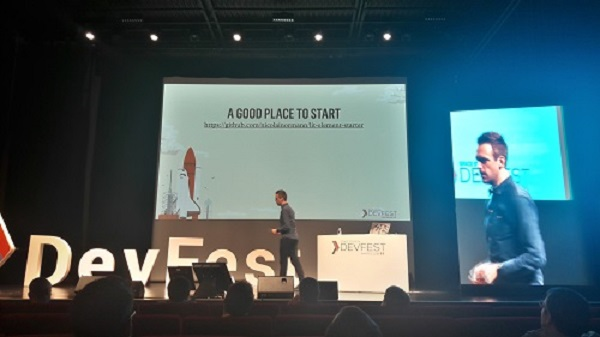

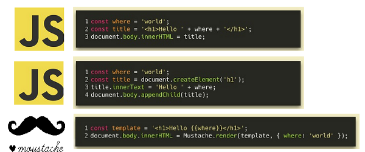

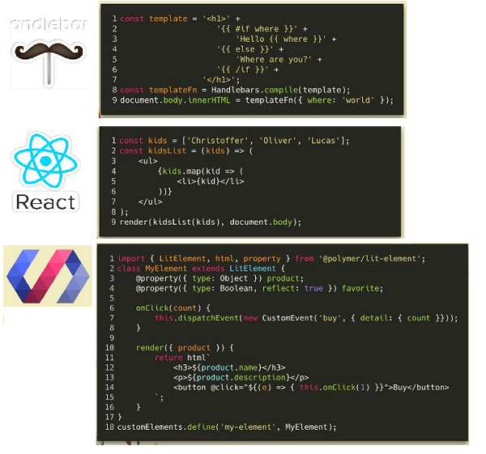

---

Reprise à 14h après un bon repas!

## 14h00 - Typographie et accessibilité

Un talk à mi-chemin entre UX et Accessibilité, et un bon rappel sur la définition d'un handicap (comment rendre accessible son site ou applications, et pourquoi).

Rappel: Handicap ou limite ne correspondent pas forcément à une personne handicapée, au sens légal du terme. Beaucoup de troubles, d'invalidités ou de blessures temporaires entrent dans cette définition (rappel: 80% des handicaps ne se voient pas).

Derrière l'effort à fournir, en plus de la valeur légale, il y la valeur morale de pousser une solution UX vers RGAA.
Les enjeux: l'accessibilité numérique est un droit depuis quelques années. Il y a deux normes WCAG (W3C), RGAA (France) pour l'implémenter. Ces deux normes sont des méthodologies, non des outils. Elles ne fournissent pas de solutions, mais des critères pour vous aider à valider votre site. En France nous avons RGAA avec trois niveaux. Soit 'A': accessible, 'AA': confort (minimum légal), 'AAA' facultatif: handicap mental ou cognitif.

Concernant la typographie, il y a deux points d'attention:
- VISU: visuelle, malvoyant, couleurs, contrastes
- DYS: dyslexie, lecture, gestes, chiffres, mémoire

Les préconisations: reposer sur ce que fait la plateforme (navigateur) plutôt que votre code (JavaScript et widgets), afin de ne pas tout 'casser' quand l'utilisateur à un zoom, une navigation ou un écran différent. Utiliser la taille de police pour hiérarchiser le contenu. Toujours définir les tailles en unité 'em' (unité relative), que ce soit pour les polices, les interlignes ou les inter-paragraphes. La largeur de police en 'ch'. Les polices 'web-safe' classiques ('verdana', 'arial', 'tahoma', 'trebuchet'). Voir même laisser l'utilisateur personnaliser son expérience, via les polices, le contraste, le thème. Des outils automatisés existent pour détecter les erreurs flagrantes.

- [-> La présentation sur la Typographie et accessibilité](https://devfest2018.access42.net/)
- [-> Le twitter du speaker](https://twitter.com/kReEsTaL)

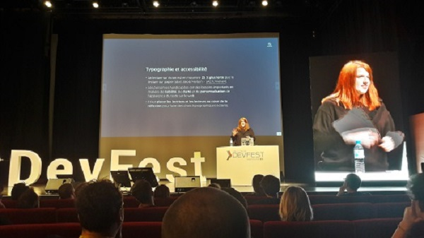

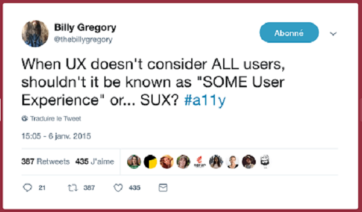

## 15h00 - L'infrastructure as code avec Terraform

Un talk sur la nouvelle orientation de Terraform, qui passe de gestion d'infrastructure vers la gestion de 'providers' fournissant des APIs (Graphana, Cubernetis, base de données, outils), et donc une solution d'Infrastructure-As-Code.
 
Il propose une compatibilité accrue par rapport à ses concurrents: beaucoup de 'providers' pour Terraform sont maintenus par le produits tiers eux-mêmes (ex: produits Google). Et introduit son propre vocabulaire: topologie ('topology') des ressources ('provider)' qui ont des états ('state'). En se basant autour d'un langage maison (malheureusement), le HCL, mais facile à lire et à générer par les outils (Ansible, utilise le YML, un langage standardisé lui).

Ses points forts:
- provider-specific: Le code écrit est spécifique aux ressources. ex: un programme écrit pour un cloud Google ne fonctionnera pas sur un cloud Amazon.
- cloud-agnostic: Le workflow autour est générique. ex: la gestion de l'infra ('topoly') d'une infra sera la même que cela soit sur un cloud Amazon ou Google.

TerraForm introduit de la gestion d'état dans Infrastructure-As-Code (contrairement à Ansible, qui ne gère que des script/code et des ressources). L'avantage est sur la modification de l'infrastructure. Par exemple: si une personne modifie manuellement une ressource (une VM), Terraform le détectera et jouera la partie de code concernant cette partie de l'infra, et seulement elle. Il profite également de modules via HTTP ou GitHub ou S3.

Conclusion: par rapport à Ansible, il y a plus de complexité introduite (via le code et la gestion d'états), mais maintenable et réactive (moins monolithique). Ansible est plus simple et rappel le python pour les Ops, mais il est difficile de rendre la solution modulaire. Terraform à essayer donc, mais quelques questions sur l'avenir du produit, notamment sa compatibilité à long terme avec les clouds et l'évolution de son langage. 

- [-> Le twitter du speaker](https://twitter.com/MathieuHerbert)

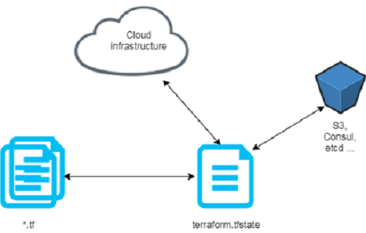

## 16h00 - A la découverte des algorithmes génétiques

Un codelab cette fois (travaux pratiques sur deux heures) autour des algorithmes génétiques.

Une expérience un peu rude, car limitée dans le temps sur un sujet qui m'était inconnu: Il fallait résoudre un problème, très rapidement présenté, en étant par équipe, le tout en compétition, en seulement une heure, en installant son poste! Heureusement, après 20min d'égarement, nous avons compris quel était le sujet, et tout est rentré dans l'ordre.

Ce que j'en ai ressorti: quand il est question de machine-learning, nous y associons souvent les réseaux de neurones et des jeux de données massifs pour l'apprentissage. Ici le but est le même: la machine doit apprendre seule, mais plutôt que de renforcer des réseaux de neurones, nous allons soumettre des solutions aléatoires à la 'sélection' naturelle (comprendre: les moins bonnes solutions disparaissent), puis y ajouter une touche d'aléatoire ('mutation') pour éviter les impasses, jusqu'à obtenir un candidat adapté au problème ('fit').

En somme, du Darwinisme (algorithmes génétiques), plutôt que de l'apprentissage spécialisé (réseau de neurones).

Bilan: petit plaisir coupable, mon équipe (en violet ci-dessous) s'en est bien sortie, malgré un algo trop aléatoire ...la nature fait bien les choses (le but était de produire une voiture qui roulait, testé dans un simulateur web).

- [-> Le starter du codelab sur algorithmes génétiques](https://github.com/sebastienD/genetic-car/tree/master/genetic-car-starters/genetic-car-starter-java)
- [-> Le twitter du speaker](https://twitter.com/seb_express)
- [-> Un peu de littérature pour comprendre](http://www.theprojectspot.com/tutorial-post/creating-a-genetic-algorithm-for-beginners/3)

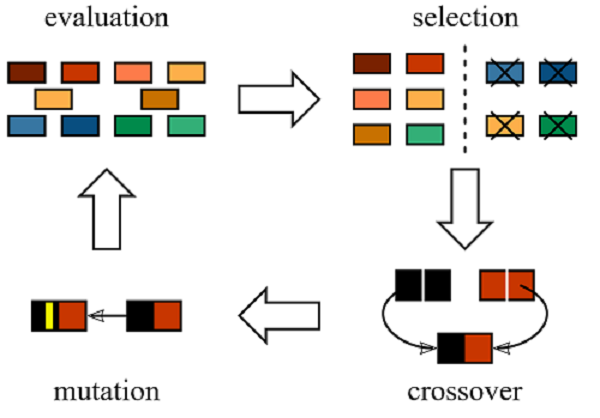

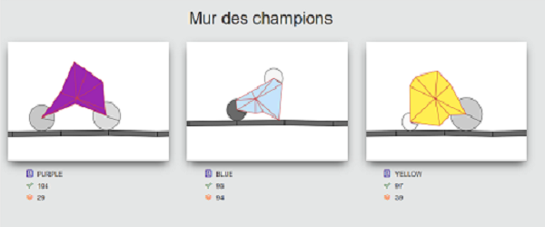

---

Et enfin quelques 'quickies' pour finir (talks courts et moins poussés). 

# BILAN

Une conférence sympa, du choix entre les sujets (web, IoT, mobile, etc), pour tous les niveaux et dans tous les formats (talk, codelab). Mais, des salles un peu surchargées et quelques soucis pour la retransmission des talks dans les salles annexes.

- [-> Retrouver tout les moments forts sur le twitter du DevFest Nantes](https://twitter.com/devfestnantes)

# PRESENTATION

```
Justine POEZEVARA

jpoezevara@sqli.com
```

```
Damien FREMONT
Expert technique SQLI
En mission au Ministère des Affaires Etrangères, Nantes
https://twitter.com/Damien_Fremont
dfremont@sqli.com
```
