IndieGame – Using Trello for Project Management
======

Do you find project management stressful? Do you struggle to keep your tasks, team members, and goals organized? Here’s how to manage your project with a simple and free tool like Trello. Whether on desktop or mobile.

Staying on top of these things can be frustrating—but with the right tool, the entire process can become streamlined, efficient, and easier for everyone. The right tool will turn you into a project management master, able to get updates, reprioritize tasks, and communicate with your team on the fly.

What’s the tool that will give you these project management superpowers? Trello.

There are a lot of project management tools out there. But Trello stands out from the crowd with its simplicity. It provides a straightforward system for organizing and monitoring projects at a glance. It’s so simple, in fact, that you might be tempted to pass it up in favor of something that requires a week-long training course.

But Trello’s simplicity is its greatest strength. Let’s take a look at how it can turn you into an organizational ace.

## Contents

*   Create a Trello account
*   Create a Trello Team
*   Create a Trello Board
    *   Lists: categorizing your activities
    *   Labels: categorizing your cards
*   Add some tasks to Board
    *   Flow example
*   Install the mobile app
    *   Share it with team members

The final board:

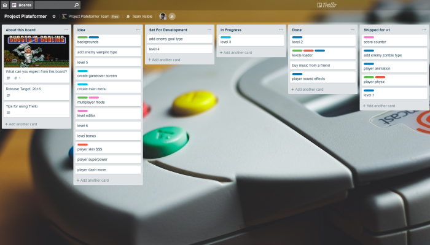

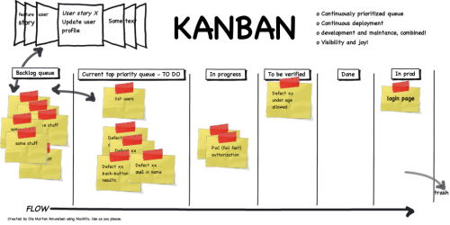

* * *

## Create a Trello account

Go to Trello’s signup and use the ‘Sign up with Google’.

[https://trello.com/signup](https://trello.com/signup)

* * *

## Create a Trello Team

Each one can be used by a whole company, a separate team within it, a non-work related group such as your family or friends, or just yourself. A Team unit can even represent a single complex project that has numerous sub-units.

Create a new team by clicking the “+” button at the left hand side of your Trello header. Add a name, picture and people to your team, then save

* * *

## Create a Trello Board

Within the Teams you create or join, the Board is the main working unit. It looks and feels like a whiteboard where you manage your work with sticky notes. Write new ones, move them around, and archive old ones.

Boards can be used in myriad ways. They can be dedicated to the **whole workflow** of a particular team or **separate activities** within it. Alternatively, they can focus on a **single project or event**.

From the team’s Boards tab, click “Create new board” in the Trello header directly to the left of your name, and select “Create Board.”

1.  Set a name for your board, choose a background and a Team.
2.  Create your first list ‘About this board’
3.  Create your first card in it ‘What can you expect from this board?’
4.  Add a picture to the card with ‘attachment’, then complete decription
5.  And some other cards like ‘Release Target: 2018’ and ‘Tips for using this Board’

* * *

### Lists: categorizing your activities

The next thing in the Trello workflow is Lists. They’re the classifiers of your activities within a Board.

There are numerous ways to go about using Lists. If you stick to the classical Kanban approach of Trello, your lists would hold your to-dos, in-progress tasks, and things you’ve finished. Each list can represent any way of grouping tasks that makes sense for your work. This can be their subject area, priority level, responsible person, or other classifying criteria.

Use the following:

1.  Idea
2.  Set for Development
3.  In Progress
4.  Done

**Tips**

later you can add more lists,  for each release: coping Done’s content to Shipped for v1, Shipped for v2, etc

* * *

### Labels: categorizing your cards

Trello labels can be used for tracking which types activities your team is spending time on.

To set labels in Trello, Just open the menu and click on “Labels”. There you can give names to the default labels or create new ones – as many as you like!

Use the following:

1.  Need attention (something need to be rework before work)
2.  Must have (core elements to your project, like gameplay)
3.  Nice to have (optionnal elements to your project, like lootbox, skins)
4.  Whishlist proposal (An idea that you maybe want in the Set for development list)
5.  Hot! (it’s a bug, an issue or it’s urgent)

**Tips**

You can also add and remove labels pressing “l” to bring up a pop-over menu of labels. Toggle an individual label by pressing numbers between 1 and 9\. Individual label shortcuts are mapped below.

You can use ASCII art to make icons for your labels:  /!\ [x] [_] <?> ♥ …

### 

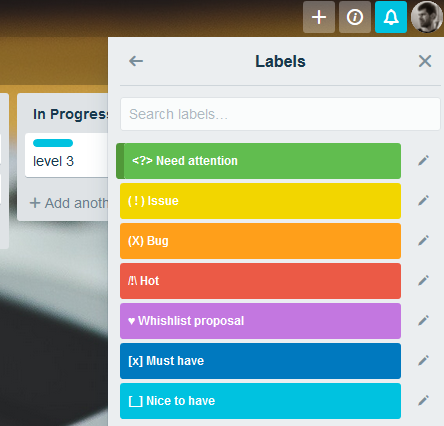

* * *

## Add some tasks to Board

### Cards: where work gets done

The smallest unit of work in Trello is the card. Cards are super flexible and allow you to include **descriptions**, **attachments**, **subtasks or** **checklists**, **due** **dates** **and times**, **assignees**, and **labels**. A card typically represents a single task in your workflow.

You can **upload images and files** from your device, or from Google Drive, Dropbox, Box, or OneDrive. And with a simple click-and-drag, cards can be moved from one list to another.

*   Some cards are simple: use a name and description
*   Some cards are heavy: use a checklist
*   Some tasks have deadline: use a due date
*   then put a label if a type is needed

**Tips**

You can add multiple card in a one-shot action if the text in it have multiple lines.

* * *

## Flow example

Start

1.  Create basic tasks for your project (tools install, helloworld project, brainstorming)
2.  Do it!
3.  Only when done, create a lot of tasks (idea1, idea 2, idea 3)
4.  Priorize it, add a ‘whishlist’ label if needed

Iterate

1.  Move 3-5 of your top ‘idea’ cards to ‘set for dev’
2.  Do it! Experiment with it !
3.  When Done, repeat

End

1.  When you hit your target for v1, copy it to a new list ‘shipped for v1’ for archive purpose (Done is now empty)
2.  Release your game
3.  Then restart a new version

**Tips**

Always finish a card before working on the next.

Always start your card with a verb if it’s a task.

Check checklists’ boxes to follow Card advancement.

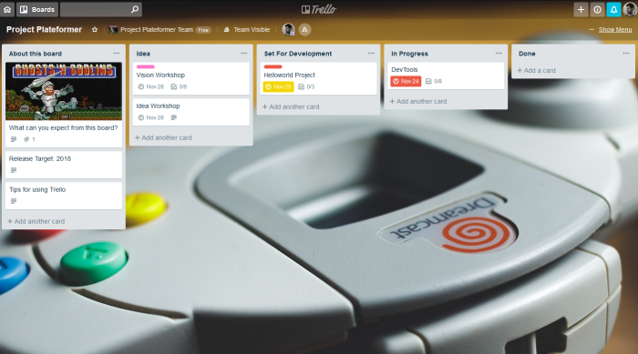

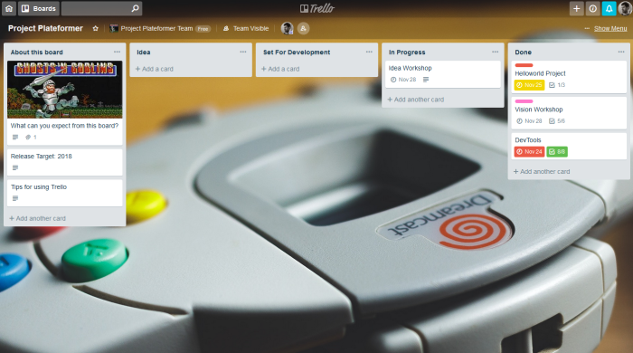

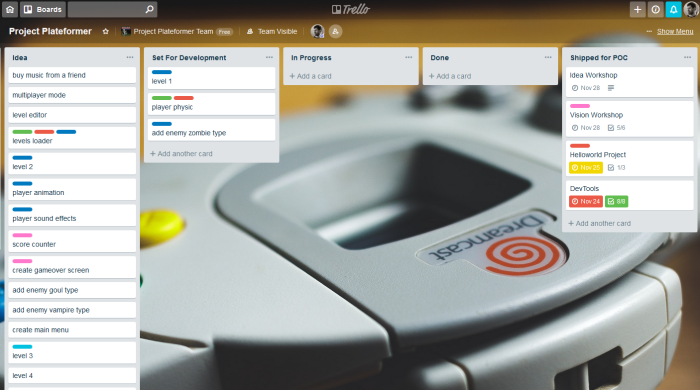

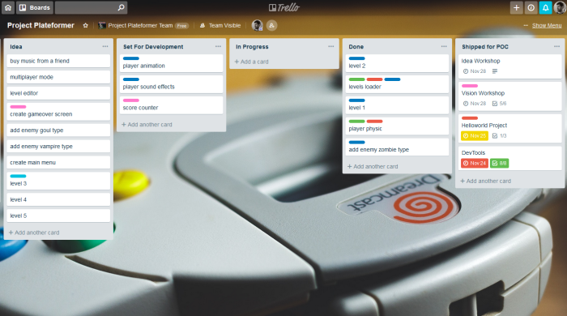

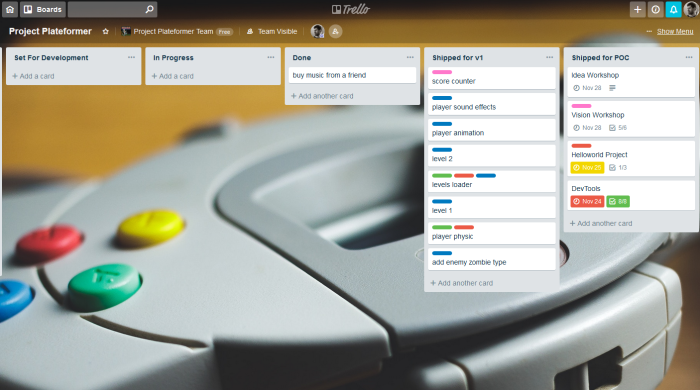

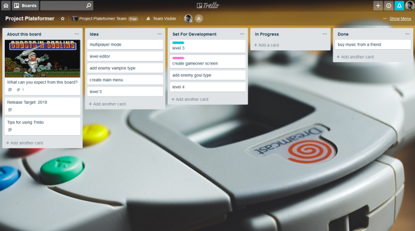

* * *

## Install the mobile app

The app is available on desktop web browser or on your mobile app : use it at anytime whenever you have an idea (transport, bed, work, etc).

[https://trello.com/platforms](https://trello.com/platforms)

* * *

## Share it with team members

You can invite others to your boards and teams by sharing a special link with them.

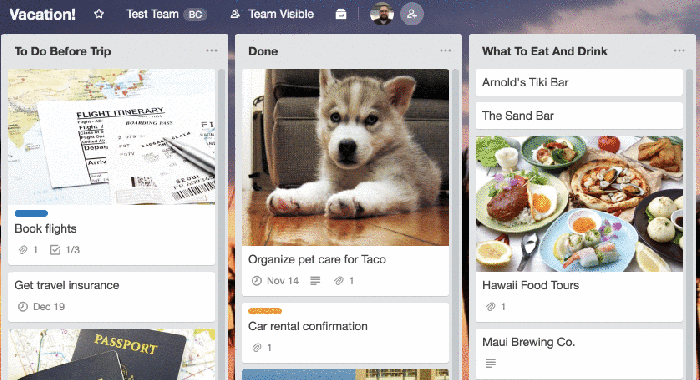

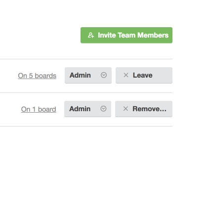

* * *

## References

[https://trello.com/b/TTAVI7Ny/ue4-roadmap](https://trello.com/b/TTAVI7Ny/ue4-roadmap)

[https://blog.trello.com/how-to-scrum-and-trello-for-teams-at-work](https://blog.trello.com/how-to-scrum-and-trello-for-teams-at-work)

[https://help.trello.com/article/705-creating-a-new-team](https://help.trello.com/article/705-creating-a-new-team)

[https://help.trello.com/article/717-adding-people-to-a-board](https://help.trello.com/article/717-adding-people-to-a-board)
