Photoshop script to translate text layers based on language JSON files, then export project to PNG images for each language. Save a lot of time!

Usage: generate screenshots files for your app (ex: Googleplay, etc).

One project is converted to X languages screenshots. With the seconde script, you can also convert each group layer as a separate files (for multi-screenshots project).

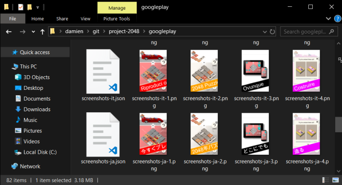

## Getting started (one screenshot by project)

*   Open test photoshop file `./test/project-to-screenshot.psd`
*   Execute `text-project-translate.bat`
*   Get your results from your `Documents` folder

NOTE: Edit `output` value in `text-project-translate.jsx` with you want to change the target folder

NOTE: Edit `project-to-screenshot-fr.json` or `project-to-screenshot-en.json` content to change translation text.

NOTE: Edit same keys in Photoshop projet AND `*.json` files.

NOTE: Use ‘Unicode’ type for universal support (asian and russian fonts).

## Example – Test with 1 Screenshot (project)

text-project-translate.bat
````bash
"C:\Program Files (x86)\Photoshop\Photoshop.exe" c:\Users\damien\git\photoshop-script-text-translator\text-project-translate.jsx
````

text-project-translate.jsx
````javascript
/**
 * Photoshop script to translate text layers based on lang
 * JSON file, then export project to PNG images for each
 * language.
 *
 * Usage: generate screenshots files for your app (ex:
 * Googleplay, etc).
 *
 * @param langs array of languages, linked to translation
 * files named like '-.json'
 * @param langFallback language to use when json file does
 * not exist.
 * @param (input) Current Photoshop project
 * @param (output) Current Photoshop project
 */
 
var langs = ["en", "ja", "ko", "zh-TW", "de", "fr", "pt", "es", "it", "ru", "hi"];
var langFallback = "en";
// get the path of currently opened photoshop document
var output = app.activeDocument.path;
var input = app.activeDocument.path;
 
/* UTILS *************************************************** */
 
// Because Photoshop doesn't
function JSON_parse(fileContent) {
    /// Extend script doesn't support JSON. Are you fucking kidding?
    // obj = JSON.parse(file_to_read .read());
    // Worry not. We got potentially harmful, yet useful, `eval` function.
    var jsonFile = eval("(" + fileContent + ")");
    return jsonFile;
}
 
function FILE_toString(fileToRead) {
    if (fileToRead === false) {
        alert("File read error:" + jsonFilePath);
    }
    fileToRead.open('r');
    var fileContent = fileToRead.read();
    fileToRead.close();
    return fileContent;
}
 
function loadLangFile(langKey) {
 
}
 
/* EXECUTION *************************************************** */
 
//Get the currently opened Photoshop document
var doc = app.activeDocument;
 
// get filename without extension
var filename = doc.name;
filename = filename.slice(0, filename.lastIndexOf(".")); //just add this line to the construction.      
 
// execute for eqch languages
for (var t = 0; t &lt; langs.length; t++) {
    var currentLang = langs[t];
    var fileContent;
 
    // Use absolute path for the JSON file.
    var langFilePath = input + &quot;/&quot; + filename + &quot;-&quot; + currentLang + &quot;.json&quot;;
    var fileToRead = File(langFilePath);
    fileContent = FILE_toString(fileToRead);
 
    // Use default language if file not found!
    if (fileContent === &quot;&quot;) {
        var langFilePath2 = input + &quot;/&quot; + filename + &quot;-&quot; + langFallback + &quot;.json&quot;;
        var fileToRead2 = File(langFilePath2);
        fileContent = FILE_toString(fileToRead2);
    }
 
    var messages = JSON_parse(fileContent);
 
    // Translate each text layers and sub layers
    for (var i = 0; i <span id="mce_SELREST_start" style="overflow:hidden;line-height:0;"></span>&lt; doc.layers.length; i++) {
        var currLayer = doc.layers[i];
 
        // check layer is visible
        if (currLayer.visible === false) {
            break;
        }
 
        // check layer is text
        if (currLayer.kind != LayerKind.TEXT) {
            break;
        }
 
        // get translation
        var translation = messages[currLayer.name];
 
        // check translation founded
        if (!translation) {
            break;
        }
 
        // set new text
        currLayer.textItem.contents = translation;
    }
 
    // save
    var file = new File(output + &quot;/&quot; + filename + &quot;-&quot; + currentLang + &quot;.png&quot;);
    var saveOptions = new PNGSaveOptions();
    doc.saveAs(file, saveOptions, true, Extension.LOWERCASE);
}
````

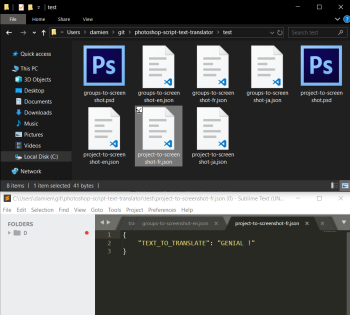

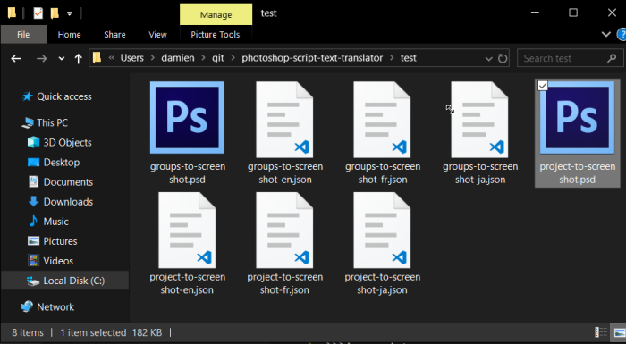

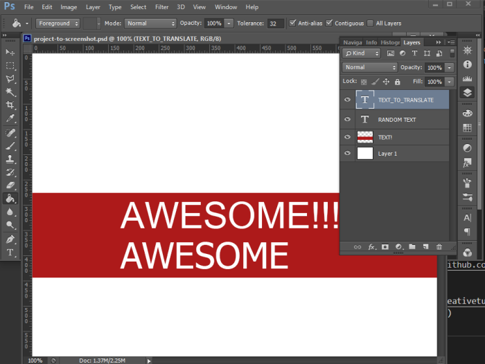

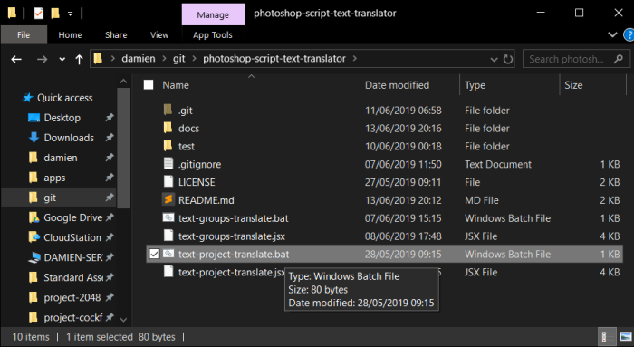

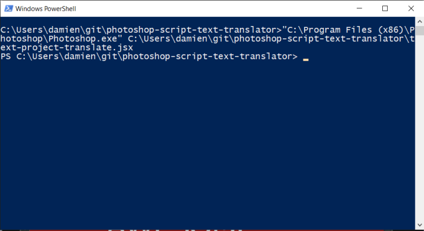

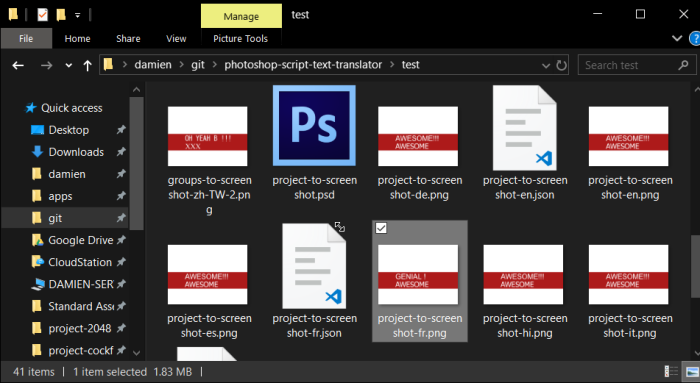

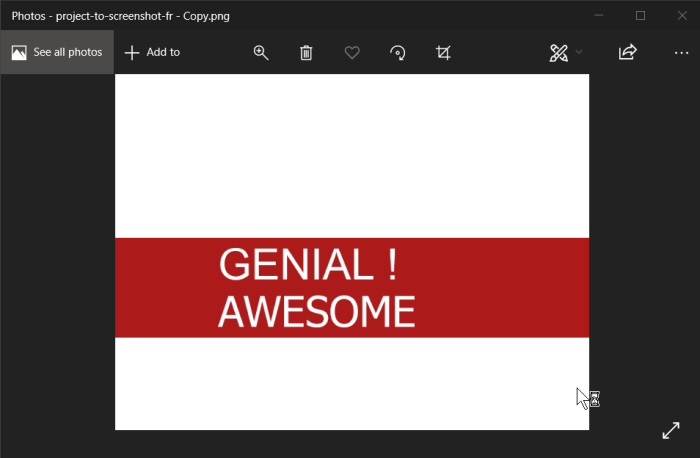

## Getting started (multiple screenshot layers by project)

*   Open test photoshop file `./test/layers-to-screenshots.psd`
*   Execute `text-layers-translate.bat`
*   Get your results from your `Documents` folder

## Example – Test with 2 Screenshot (group)

text-group-translate.bat
````bash
"C:\Program Files (x86)\Photoshop\Photoshop.exe" c:\Users\damien\git\photoshop-script-text-translator\text-groups-translate.jsx
````


text-groups-translate.jsx
````javascript
/**
 * Photoshop script to translate text layers based on lang
 * JSON file, then export project to PNG images for each
 * language.
 *
 * Usage: generate screenshots files for your app (ex:
 * Googleplay, etc).
 *
 * @param langs array of languages, linked to translation
 * files named like '-.json'
 * @param langFallback language to use when json file does
 * not exist.
 * @param (input) Current Photoshop project
 * @param (output) Current Photoshop project
 */
 
var langs = ["en", "ja", "ko", "zh-TW", "de", "fr", "pt", "es", "it", "ru", "hi"];
var langFallback = "en";
// get the path of currently opened photoshop document
var inputPath = app.activeDocument.path;
var outputPath = app.activeDocument.path;
 
/* UTILS *************************************************** */
 
// Because Photoshop doesn't
function JSON_parse(fileContent) {
    /// Extend script doesn't support JSON. Are you fucking kidding?
    // obj = JSON.parse(file_to_read .read());
    // Worry not. We got potentially harmful, yet useful, `eval` function.
    var jsonFile = eval("(" + fileContent + ")");
    return jsonFile;
}
 
function FILE_toString(fileToRead) {
    if (fileToRead === false) {
        alert("File read error:" + jsonFilePath);
    }
    fileToRead.open('r');
    var fileContent = fileToRead.read();
    fileToRead.close();
    return fileContent;
}
 
/* EXECUTION *************************************************** */
 
//Get the currently opened Photoshop document
var doc = app.activeDocument;
 
// get filename without extension
var filename = doc.name;
filename = filename.slice(0, filename.lastIndexOf(".")); //just add this line to the construction.      
 
// execute for each group
for (var y = 0; y &lt; doc.layers.length; y++) {
    var currentGroup = doc.layers[y];
 
    // check layer is visible
    if (currentGroup.kind != undefined) {
        break;
    }
 
    // Pass sub layers to core script
    var groupLayers = currentGroup.layers;
    // hide others groups
    for (var t = 0; t &lt; doc.layers.length; t++)
        doc.layers[t].visible = false;
    currentGroup.visible = true;
 
    // execute for each languages
    for (var t = 0; t &lt; langs.length; t++) {
        var currentLang = langs[t];
        var fileContent;
 
        // Use absolute path for the JSON file.
        var langFilePath = inputPath + &quot;/&quot; + filename + &quot;-&quot; + currentLang + &quot;.json&quot;;
        var fileToRead = File(langFilePath);
        fileContent = FILE_toString(fileToRead);
 
        // Use default language if file not found!
        if (fileContent === &quot;&quot;) {
            var langFilePath2 = inputPath + &quot;/&quot; + filename + &quot;-&quot; + langFallback + &quot;.json&quot;;
            var fileToRead2 = File(langFilePath2);
            fileContent = FILE_toString(fileToRead2);
        }
 
        var messages = JSON_parse(fileContent);
 
        // Translate each text layers and sub layers
        for (var i = 0; i <span id="mce_SELREST_start" style="overflow:hidden;line-height:0;">&#65279;</span>&lt; groupLayers.length; i++) {
            var currLayer = groupLayers[i];
 
            // check layer is visible
            if (currLayer.visible === false) {
                break;
            }
 
            // check layer is text
            if (currLayer.kind != LayerKind.TEXT) {
                break;
            }
 
            // get translation
            var translation = messages[currLayer.name];
 
            // check translation founded
            if (!translation) {
                break;
            }
 
            // set new text
            currLayer.textItem.contents = translation;
        }
 
        // save
        // TODO: create outputPath
        var file = new File(outputPath + &quot;/&quot; + filename + &quot;-&quot; + currentLang + &quot;-&quot; + (y + 1) + &quot;.png&quot;);
        var saveOptions = new PNGSaveOptions();
        doc.saveAs(file, saveOptions, true, Extension.LOWERCASE);
    }
}
````

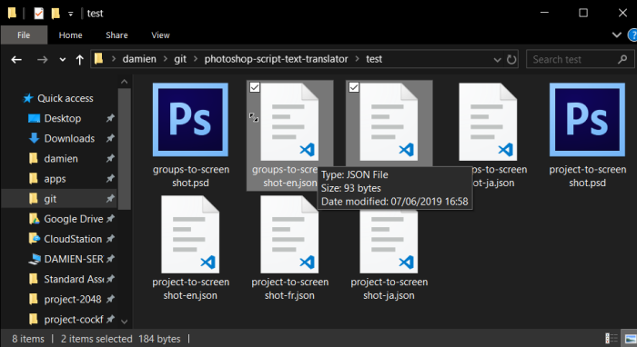

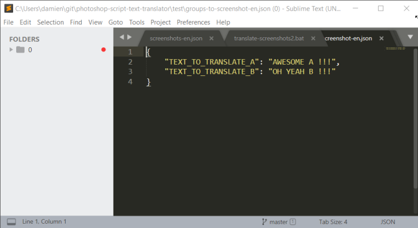

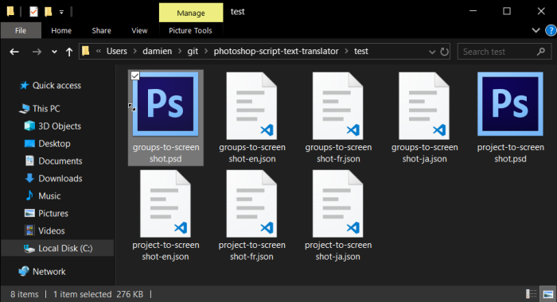

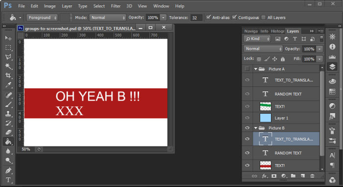

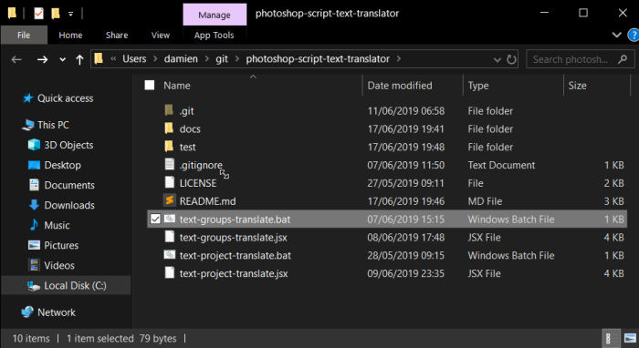

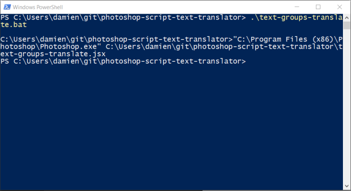

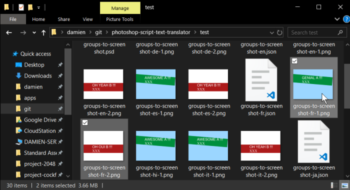

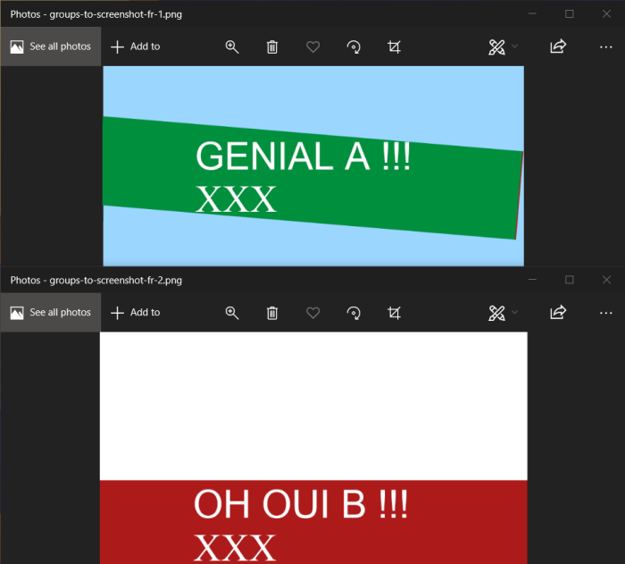

## Example – External Project

text-group-translate.bat

<pre class="language-javascript"><span class="token string">"C:\Program Files (x86)\Photoshop\Photoshop.exe"</span> c<span class="token punctuation">:</span>\Users\damien\git\photoshop<span class="token operator">-</span>script<span class="token operator">-</span>text<span class="token operator">-</span>translator\text<span class="token operator">-</span>groups<span class="token operator">-</span>translate<span class="token punctuation">.</span>jsx
</pre>

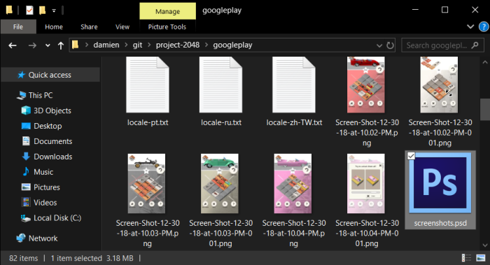

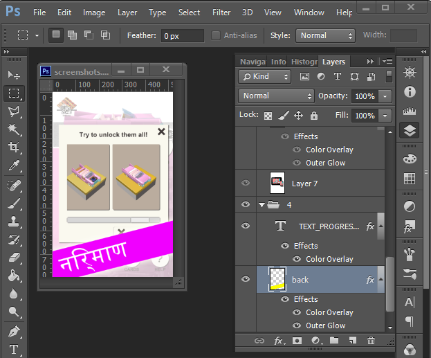

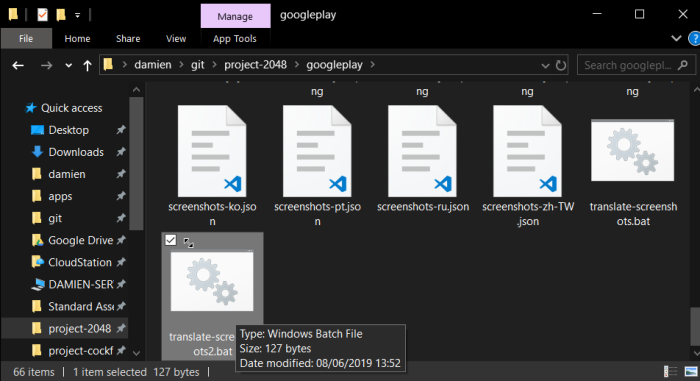

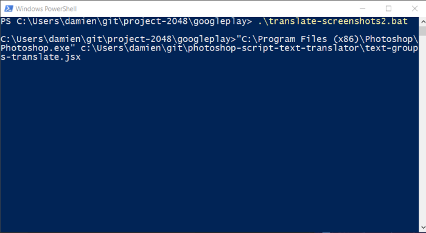


## References

*   [Photoshop read json file](https://github.com/fabianmoronzirfas/extendscript/wiki/Read-In-JSON-From-File-And-DONT-Eval)
*   [Photoshop get layer type](http://creativetuts.com/photoshop-script-determine-layer-kind/)