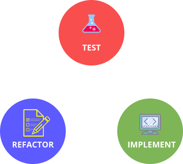
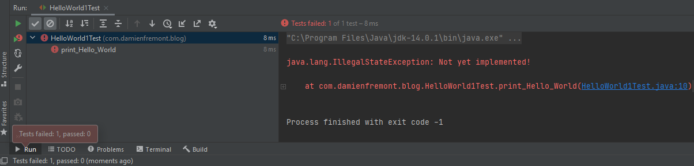
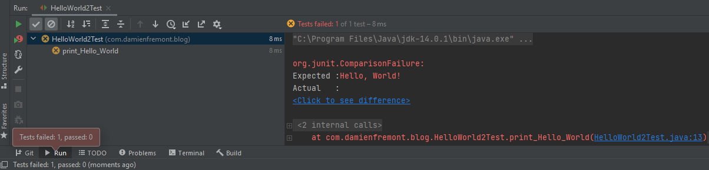
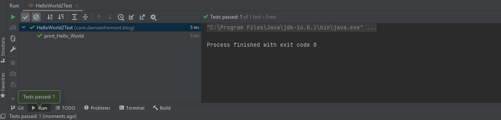
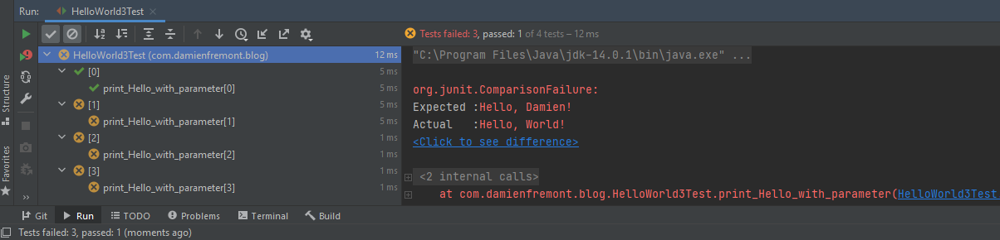
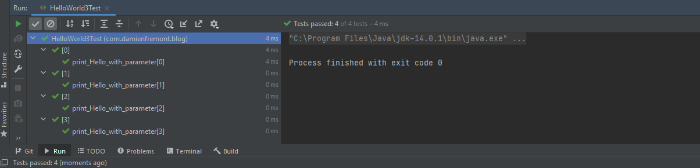
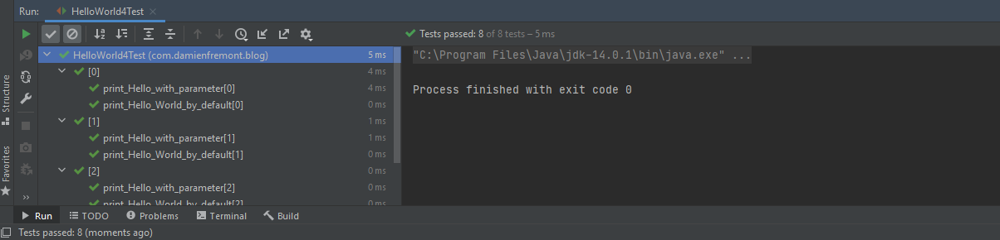
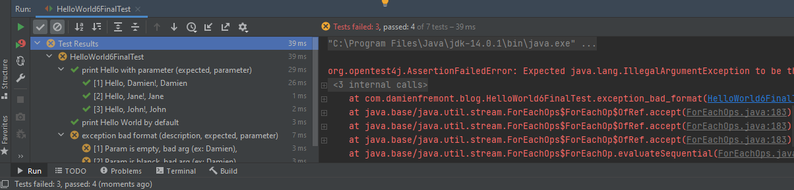
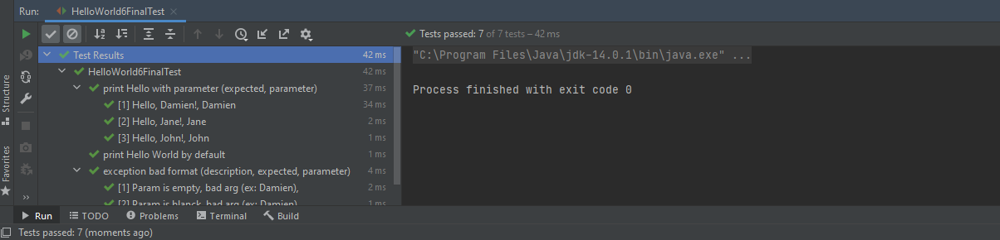

Test Driven Development (TDD) in Java - HelloWorld Examples
===========================================================


Test-driven development is not about testing. Test-driven development is about development (and design), specifically improving the quality and design of code. The resulting unit tests are just an extremely useful by-product.

### TDD life-cycle

Before explaining best practices, it is important to understand the TDD life-cycle.
- Write the test
- Run the test (there is no implementation code, test does not pass)
- Write just enough implementation code to make the test pass
- Run all tests (tests pass)
- Refactor
- Repeat



---

## Result

HelloWorldTest.java
```java
package com.damienfremont.blog;

import com.damienfremont.blog.utils.JUnit5Parent;
import org.junit.jupiter.api.*;
import org.junit.jupiter.params.ParameterizedTest;
import org.junit.jupiter.params.provider.CsvSource;

@DisplayNameGeneration(DisplayNameGenerator.ReplaceUnderscores.class)
public class HelloWorld6FinalTest extends JUnit5Parent {

    @Test
    void print_Hello_World_by_default() {
        String expected = "Hello, World!!";
        HelloWorld6Final.main(null);
        Assertions.assertEquals(expected, getOutput());
    }

    @DisplayName("print Hello with parameter (expected, parameter)")
    @ParameterizedTest
    @CsvSource({
            "'Hello, Damien!', Damien",
            "'Hello, Jane!', Jane",
            "'Hello, John!', John",
    })
    void print_Hello_with_parameter(String expected, String parameter) {
        String[] args = {parameter};
        HelloWorld6Final.main(args);
        Assertions.assertEquals(expected, getOutput());
    }

    @DisplayName("exception bad format (description, expected, parameter)")
    @ParameterizedTest
    @CsvSource({
            "Param is empty,  bad arg (ex: Damien), ''  ",
            "Param is blanck, bad arg (ex: Damien), ' ' ",
            "Param is null,   bad arg (ex: Damien), null"
    })
    void exception_bad_format(String description, String expected, String parameter) {
        String[] args = {parameter.equals("null") ? null : parameter};
        Exception e = Assertions.assertThrows(IllegalArgumentException.class, () -> {
            HelloWorld6Final.main(args);
        });
        Assertions.assertEquals(expected, e.getMessage());
    }
}
```

---

## Specifications

This tutorial will implement the following specifications.

- Print "Hello, World!"
- Print "Hello, <MY NAME>!", where <MY NAME> is a parameter
- If parameter is not present, Print "Hello, World!"
- If parameter is not null or empty, then exception "bad arg (ex: Damien)"

---

## Steps

Order is important, next step is also solution to previous step.
(in Git Projet, Just follow classes named `HelloWorld*Test` order)

1. Start by developing `Print "Hello, World!"`
    1. `HelloWorldTest#print_Hello_World` Complete the test 
    2. `HelloWorldTest#print_Hello_World` Run the test (test does not pass)
    3. `HelloWorld` Write just enough implementation code to make the test pass
2. Repeat with `Print "Hello, <MY NAME>!", where <MY NAME> is a parameter`
    1. `HelloWorldTest#print_Hello_with_parameter` Complete the test 
    2. `HelloWorldTest#print_Hello_with_parameter` Run the test (test does not pass)
    3. `HelloWorld` Write just enough implementation code to make the test pass
    4. `HelloWorldTest#*` Run all tests (tests pass)
3. Repeat with `If parameter is not present, Print "Hello, World!"`
    1. `HelloWorldTest#print_Hello_World_by_default` Complete the test
    2. `HelloWorldTest#print_Hello_World_by_default` Run the test (test does not pass)
    3. `HelloWorld` Write just enough implementation code to make the test pass
    4. `HelloWorldTest#*` Run all tests (tests pass)
4. Refactor
   1. `HelloWorldTest` Migrate to JUnit5
   1. `HelloWorld` Use Ternary operator for inline condition
5. Repeat with `If parameter is not null or empty, then exception "bad arg (ex: Damien)"`
    1. `HelloWorldTest#exception_bad_format` Complete the test
    2. `HelloWorldTest#exception_bad_format` Run the test (test does not pass)
    3. `HelloWorld` Write just enough implementation code to make the test pass
    4. `HelloWorldTest#*` Run all tests (tests pass)

---

### Step 0 - Initial commit

HelloWorld.java
```java
package com.damienfremont.blog;

public class HelloWorld {

    public static void main(String[] args) {
        // TODO: NEXT: Print "Hello, World!"
    }
}
```

---

### Step 1

Start by developing `Print "Hello, World!"`

HelloWorldTest.java
```java
package com.damienfremont.blog;

import com.damienfremont.blog.utils.JUnit4Parent;
import org.junit.Test;

public class HelloWorldTest extends JUnit4Parent {

    @Test
    public void print_Hello_World() {
        throw new IllegalStateException("Not yet implemented!");
        // TODO: NEXT OUTPUT: super.getOutput()
    }
}
```

Run the test (test does not pass)



Complete the test

HelloWorldTest.java
```java
package com.damienfremont.blog;

import com.damienfremont.blog.utils.JUnit4Parent;
import org.junit.Assert;
import org.junit.Test;

public class HelloWorld1Test extends JUnit4Parent {

    @Test
    public void print_Hello_World() {
        String expected = "Hello, World!";
        HelloWorld1.main(null);
        Assert.assertEquals(expected, getOutput());
    }
}
```

Run the test (test does not pass)



Write just enough implementation code to make the test pass

HelloWorld.java
```java
package com.damienfremont.blog;

public class HelloWorld1 {

    public static void main(String[] args) {
        String text = "Hello, World!";
        System.out.println(text);
    }
}
```



---

### Step 2

Repeat with `Print "Hello, <MY NAME>!", where <MY NAME> is a parameter`

HelloWorldTest.java
```java
package com.damienfremont.blog;

import com.damienfremont.blog.utils.JUnit4Parent;
import org.junit.Assert;
import org.junit.Test;

public class HelloWorld2Test extends JUnit4Parent {

    @Test
    public void print_Hello_World() {
        String expected = "Hello, World!";
        HelloWorld2.main(null);
        Assert.assertEquals(expected, getOutput());
    }

    @Test
    public void print_Hello_with_parameter() {
        throw new IllegalStateException("Not yet implemented!");
        // TODO: NEXT: Print "Hello, <MY NAME>!", where <MY NAME> is a parameter
    }
}
```

Complete the test

HelloWorldTest.java
```java
package com.damienfremont.blog;

import com.damienfremont.blog.utils.JUnit4Parent;
import org.junit.Assert;
import org.junit.Test;
import org.junit.runner.RunWith;
import org.junit.runners.Parameterized;

import java.util.Arrays;
import java.util.Collection;

@RunWith(Parameterized.class)
public class HelloWorld2Test extends JUnit4Parent {

    @Parameterized.Parameters
    public static Collection<Object[]> data() {
        return Arrays.asList(new Object[][]{
                {"Hello, World!", "World"},
                {"Hello, Damien!", "Damien"},
                {"Hello, Jane!", "Jane"},
                {"Hello, John!", "John"},
        });
    }

    private final String expected;
    private final String first;

    public HelloWorld2Test(String expected, String first) {
        this.first = first;
        this.expected = expected;
    }

    @Test
    public void print_Hello_with_parameter() {
        String[] args = {first};
        HelloWorld2.main(args);
        Assert.assertEquals(expected, getOutput());
    }
}
```

Run the test (test does not pass)



Write just enough implementation code to make the test pass

HelloWorld.java
```java
package com.damienfremont.blog;

public class HelloWorld2 {

    public static void main(String[] args) {
        String text = args[0];
        System.out.println(String.format("Hello, %s!", text));
    }
}
```



---

### Step 3

Repeat with `If parameter is not present, Print "Hello, World!"`

HelloWorldTest.java
```java
package com.damienfremont.blog;

import com.damienfremont.blog.utils.JUnit4Parent;
import org.junit.Assert;
import org.junit.Test;
import org.junit.runner.RunWith;
import org.junit.runners.Parameterized;

import java.util.Arrays;
import java.util.Collection;

@RunWith(Parameterized.class)
public class HelloWorld3Test extends JUnit4Parent {

    @Parameterized.Parameters
    public static Collection<Object[]> data() {
        return Arrays.asList(new Object[][]{
                {"Hello, World!", "World"},
                {"Hello, Damien!", "Damien"},
                {"Hello, Jane!", "Jane"},
                {"Hello, John!", "John"},
        });
    }

    private final String expected;
    private final String first;

    public HelloWorld3Test(String expected, String first) {
        this.first = first;
        this.expected = expected;
    }

    @Test
    public void print_Hello_with_parameter() {
        String[] args = {first};
        HelloWorld3.main(args);
        Assert.assertEquals(expected, getOutput());
    }

    @Test
    public void print_Hello_World_by_default() {
        throw new IllegalStateException("Not yet implemented!");
        // TODO: NEXT: If parameter is not present, Print "Hello, World!"
    }
}
```

Complete the test

HelloWorldTest.java
```java
package com.damienfremont.blog;

import com.damienfremont.blog.utils.JUnit4Parent;
import org.junit.Assert;
import org.junit.Test;
import org.junit.runner.RunWith;
import org.junit.runners.Parameterized;

import java.util.Arrays;
import java.util.Collection;

@RunWith(Parameterized.class)
public class HelloWorld3Test extends JUnit4Parent {

    @Parameterized.Parameters
    public static Collection<Object[]> data() {
        return Arrays.asList(new Object[][]{
                {"Hello, World!", "World"},
                {"Hello, Damien!", "Damien"},
                {"Hello, Jane!", "Jane"},
                {"Hello, John!", "John"},
        });
    }

    private final String expected;
    private final String first;

    public HelloWorld3Test(String expected, String first) {
        this.first = first;
        this.expected = expected;
    }

    @Test
    public void print_Hello_with_parameter() {
        String[] args = {first};
        HelloWorld3.main(args);
        Assert.assertEquals(expected, getOutput());
    }

    @Test
    public void print_Hello_World_by_default() {
        String expected = "Hello, World!!";
        HelloWorld4.main(null);
        Assert.assertEquals(expected, getOutput());
    }
}
```

Run the test (test does not pass)


Write just enough implementation code to make the test pass

HelloWorld.java
```java
package com.damienfremont.blog;

public class HelloWorld3 {

    public static void main(String[] args) {
        // TODO: NEXT: If parameter is not present, Print "Hello, World!"
        String text = args[0];
        System.out.println(String.format("Hello, %s!", text));
    }
}
```



---

### Step 4

Refactor from JUnit4 to JUnit5

HelloWorldTest.java
```java
package com.damienfremont.blog;

import com.damienfremont.blog.utils.JUnit5Parent;
import org.junit.jupiter.api.*;
import org.junit.jupiter.params.ParameterizedTest;
import org.junit.jupiter.params.provider.CsvSource;

@DisplayNameGeneration(DisplayNameGenerator.ReplaceUnderscores.class)
public class HelloWorld5Test extends JUnit5Parent {

   @Test
   void print_Hello_World_by_default() {
      String expected = "Hello, World!!";
      HelloWorld5.main(null);
      Assertions.assertEquals(expected, getOutput());
   }

   @DisplayName("print Hello with parameter (expected, parameter)")
   @ParameterizedTest
   @CsvSource({
           "'Hello, Damien!', Damien",
           "'Hello, Jane!', Jane",
           "'Hello, John!', John",
   })
   void print_Hello_with_parameter(String expected, String parameter) {
      String[] args = {parameter};
      HelloWorld5.main(args);
      Assertions.assertEquals(expected, getOutput());
   }
}
```

HelloWorld.java
```java
package com.damienfremont.blog;

public class HelloWorld5 {

    public static void main(String[] args) {
        // TODO: NEXT: `If parameter is not null or empty, then exception "bad arg (ex: Damien)"`
        String text = hasNoArgs(args) ? "World!" : args[0];
        System.out.println(String.format("Hello, %s!", text));
    }

    private static boolean hasNoArgs(String[] args) {
        return args == null || (args != null && args.length == 0);
    }
}
```

Run all tests (tests pass)


---

### Step 5

Repeat with `If parameter is not null or empty, then exception "bad arg (ex: Damien)"`

HelloWorldTest.java
```java
package com.damienfremont.blog;

import com.damienfremont.blog.utils.JUnit5Parent;
import org.junit.jupiter.api.*;
import org.junit.jupiter.params.ParameterizedTest;
import org.junit.jupiter.params.provider.CsvSource;

@DisplayNameGeneration(DisplayNameGenerator.ReplaceUnderscores.class)
public class HelloWorld5Test extends JUnit5Parent {

   @Test
   void print_Hello_World_by_default() {
      String expected = "Hello, World!!";
      HelloWorld5.main(null);
      Assertions.assertEquals(expected, getOutput());
   }

   @DisplayName("print Hello with parameter (expected, parameter)")
   @ParameterizedTest
   @CsvSource({
           "'Hello, Damien!', Damien",
           "'Hello, Jane!', Jane",
           "'Hello, John!', John",
   })
   void print_Hello_with_parameter(String expected, String parameter) {
      String[] args = {parameter};
      HelloWorld5.main(args);
      Assertions.assertEquals(expected, getOutput());
   }

   @Test
   void exception_bad_format() {
      // TODO: NEXT: `If parameter is not null or empty, then exception "bad arg (ex: Damien)"`
      throw new IllegalStateException("Not yet implemented!");
   }
}
```

Complete the test

HelloWorldTest.java
```java
package com.damienfremont.blog;

import com.damienfremont.blog.utils.JUnit5Parent;
import org.junit.jupiter.api.*;
import org.junit.jupiter.params.ParameterizedTest;
import org.junit.jupiter.params.provider.CsvSource;

@DisplayNameGeneration(DisplayNameGenerator.ReplaceUnderscores.class)
public class HelloWorld6FinalTest extends JUnit5Parent {

    @Test
    void print_Hello_World_by_default() {
        String expected = "Hello, World!!";
        HelloWorld6Final.main(null);
        Assertions.assertEquals(expected, getOutput());
    }

    @DisplayName("print Hello with parameter (expected, parameter)")
    @ParameterizedTest
    @CsvSource({
            "'Hello, Damien!', Damien",
            "'Hello, Jane!', Jane",
            "'Hello, John!', John",
    })
    void print_Hello_with_parameter(String expected, String parameter) {
        String[] args = {parameter};
        HelloWorld6Final.main(args);
        Assertions.assertEquals(expected, getOutput());
    }

    @DisplayName("exception bad format (description, expected, parameter)")
    @ParameterizedTest
    @CsvSource({
            "Param is empty,  bad arg (ex: Damien), ''  ",
            "Param is blanck, bad arg (ex: Damien), ' ' ",
            "Param is null,   bad arg (ex: Damien), null"
    })
    void exception_bad_format(String description, String expected, String parameter) {
        String[] args = {parameter.equals("null") ? null : parameter};
        Exception e = Assertions.assertThrows(IllegalArgumentException.class, () -> {
            HelloWorld6Final.main(args);
        });
        Assertions.assertEquals(expected, e.getMessage());
    }
}
```

Run the test (test does not pass)



HelloWorld.java
```java
package com.damienfremont.blog;

public class HelloWorld6Final {

    public static void main(String[] args) {
        String name = getName(args);
        String text = String.format("Hello, %s!", name);
        System.out.println(text);
    }

    private static String getName(String[] args) {
        if (hasNoArgs(args)) {
            return "World!";
        }
        if(isNullOrEmpty(args[0])) {
            throw new IllegalArgumentException("bad arg (ex: Damien)");
        }
        return args[0];
    }

    private static boolean isNullOrEmpty(String arg) {
        return arg == null || arg.trim().isEmpty();
    }

    private static boolean hasNoArgs(String[] args) {
        return args == null || (args != null && args.length == 0);
    }
}
```

Run all tests (tests pass)




And it's finished !!!

---

## Conclusion

Test-driven development is not about testing. 

Test-driven development is about development (and design), specifically improving the quality and design of code. The resulting unit tests are just an extremely useful by-product.

---

## Post

- [https://damienfremont.com/2021/02/18/test-driven-development-tdd-in-java-helloworld-examples/](https://damienfremont.com/2021/02/18/test-driven-development-tdd-in-java-helloworld-examples)

## Source

- [https://github.com/DamienFremont/damienfremont.com-blog-labs/tree/master/20210201-test-tdd-java-helloworld-examples](https://github.com/DamienFremont/damienfremont.com-blog-labs/tree/master/20210201-test-tdd-java-helloworld-examples)

## References

- https://javacodehouse.com/blog/test-driven-development-tutorial/#what-is-tdd
- https://technologyconversations.com/2014/09/30/test-driven-development-tdd/
- https://technologyconversations.com/2013/12/24/test-driven-development-tdd-best-practices-using-java-examples-2/
